# HostWise — Vacation Rental Intelligence Platform

> **Own your data. Work offline. Sync when you want.**
>
> A local-first, AI-powered financial intelligence platform for vacation rental hosts — delivered as a fast native desktop app with a fully offline, single-file database.

---

<p align="center">
  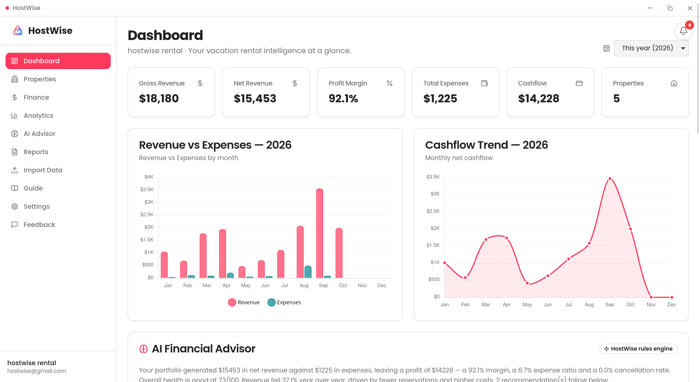
</p>

---

## 📖 Overview

**HostWise** sits above your existing data sources — Airbnb, Booking.com, VRBO, iCal feeds, and CSV exports — and turns raw booking and financial data into **professional reports, strategic insights, and actionable recommendations**.

It is a **desktop application** (Tauri + Rust) with a **100% native Rust backend** compiled directly into the binary. No Python, no Docker, no database server, no cloud, no account: your data lives in one SQLite file on your machine.

**What HostWise is NOT:** It's not a PMS. It doesn't manage bookings, process payments, or handle guest communication. It's the brain, not the hands — the layer that explains *why* your numbers changed and *what to do* next.

### Who It's For
- Individual vacation rental hosts managing 3–50 properties
- Property managers who need portfolio-level financial visibility
- Owners / investors who receive executive summaries and tax-oriented reports

---

## 🎯 The Problem

Vacation rental hosts are drowning in data but starving for insight.

- Airbnb and Booking.com give you raw booking data but **no financial analysis**
- Spreadsheets become unmanageable beyond a few properties
- PMS tools focus on operations, not financial intelligence
- Hosts can't answer basic questions like *"Which property has the best profit margin?"* or *"Why did my net revenue drop 15% this month?"*
- Tax preparation and owner reporting is entirely manual

**Current solutions** force hosts to be part-time accountants, Excel wizards, and data analysts — roles they never signed up for.

---

## 💡 The Solution

HostWise ingests your booking data (CSV and iCal today), normalizes it, and computes every financial KPI that matters — **fully offline**:

- Revenue, expenses, and cashflow per property and across your portfolio
- Profit margins, expense ratios, and trend explanations
- Property **health scores (0–100)** and data-driven rankings
- AI-powered recommendations that explain *why* and tell you *what to do*
- Automated monthly, annual, and executive financial reports (PDF export)
- Proactive in-app notifications (profit drops, revenue jumps, occupancy falls, backups, reports)

---

## 📈 System Impact

| Metric | Before HostWise | After HostWise |
|---|---|---|
| Financial report generation | 4–8 hours manually | Instant, from real data |
| Identifying underperformers | Guesswork | Health scores + data-driven ranking |
| Profit margin visibility | None | Per-property breakdowns |
| Tax preparation | Scattered spreadsheets | Single export / PDF reports |
| Revenue trend analysis | Manual charting | Built-in dashboards + AI explanations |
| Data privacy | Data scattered across SaaS | One offline SQLite file on your disk |

---

## 🚀 Core Features

- **Financial Dashboard** — gross/net revenue, expenses, profit margin, cashflow, and property count, scoped to a year or a custom period
- **Property Portfolio** — full CRUD for properties + listings, per-property analytics and health badges
- **Revenue & Expense Tracking** — categorized income and expenses per property, with per-record currency
- **Portfolio Analytics** — profit-driven KPIs, expense trends, seasonality, and property ranking
- **Monthly & Annual Reports** — professional PDF documents (executive, portfolio, performance, AI insights)
- **AI Financial Advisor** — recommendations, period-over-period reviews, and what-if scenario simulation
- **Property Health Score (0–100)** — at-a-glance performance indicator, with an honest "no data yet" state
- **Data Import** — CSV (encodings/delimiters honored, **idempotent** — no duplicates on re-import) + **iCal** for Airbnb/Booking calendar-export feeds
- **Notifications** — profit-drop / revenue-up / occupancy-fall / backup-done / report-ready alerts (deduplicated)
- **Backups** — automatic daily + manual SQLite backups, with restore and verification

---

## 📸 Screenshots

A look at HostWise in action:

| Dashboard | Properties | Finance |
|---|---|---|
|  | 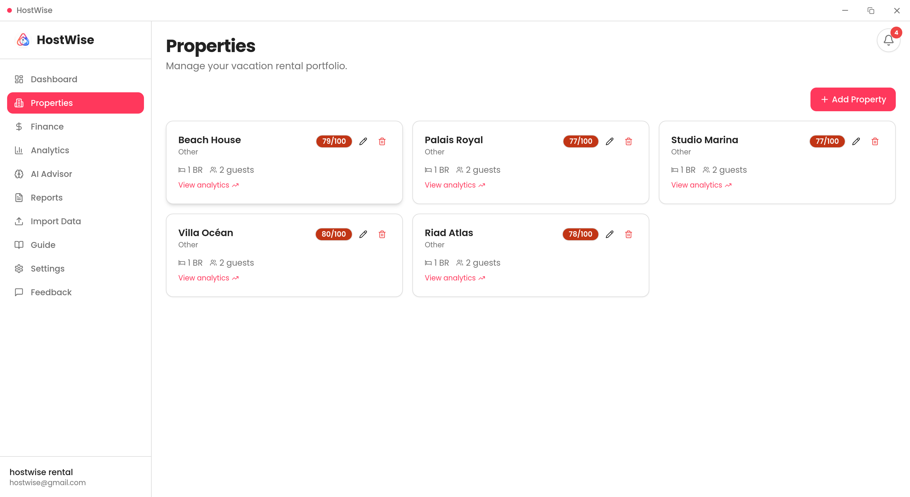 | 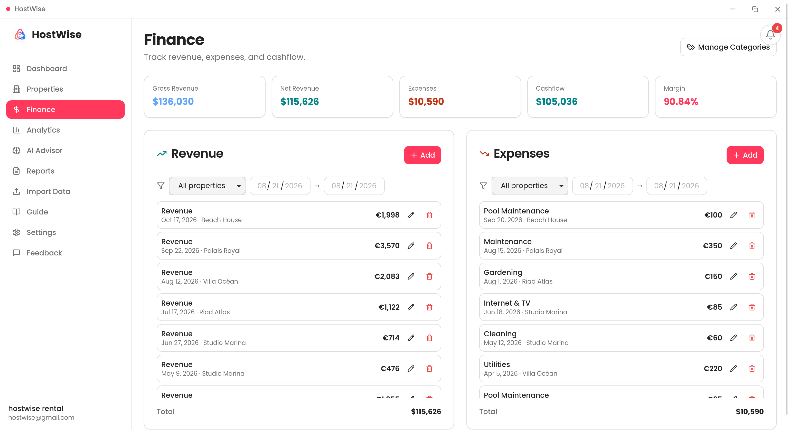 |

| Analytics | AI Advisor | Reports |
|---|---|---|
| 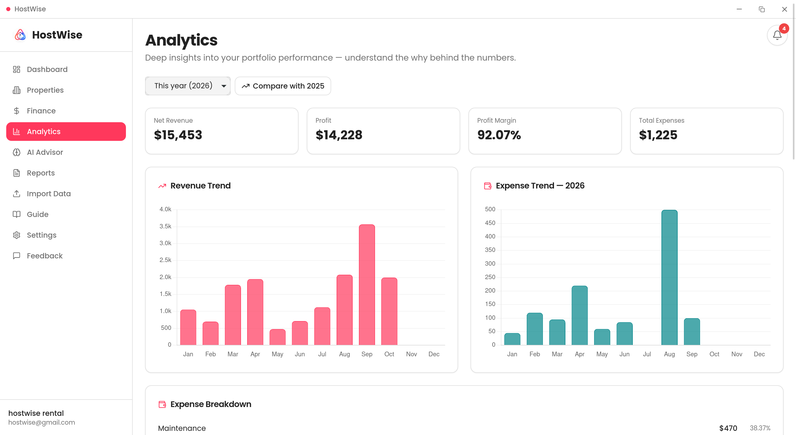 | 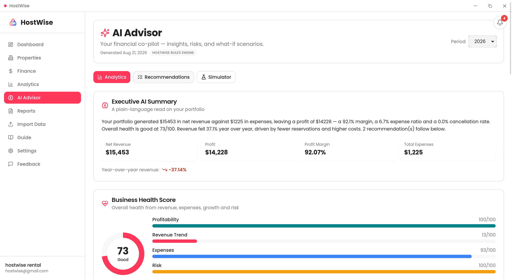 | 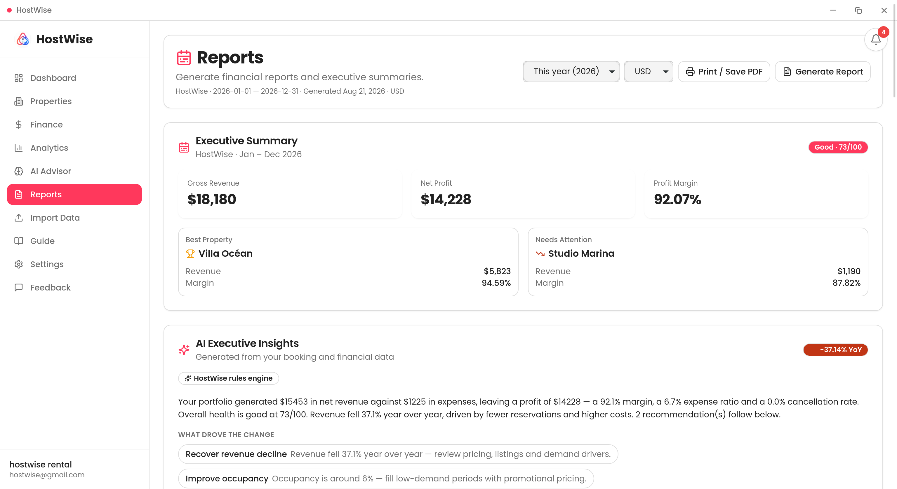 |

| Import | Settings | Dark mode |
|---|---|---|
| 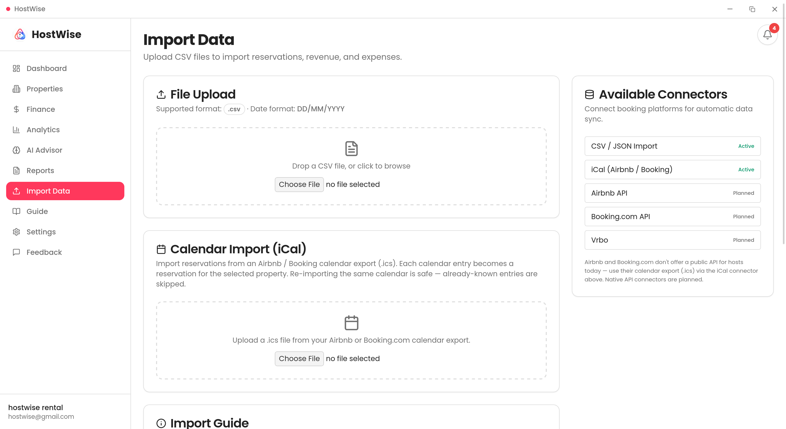 | 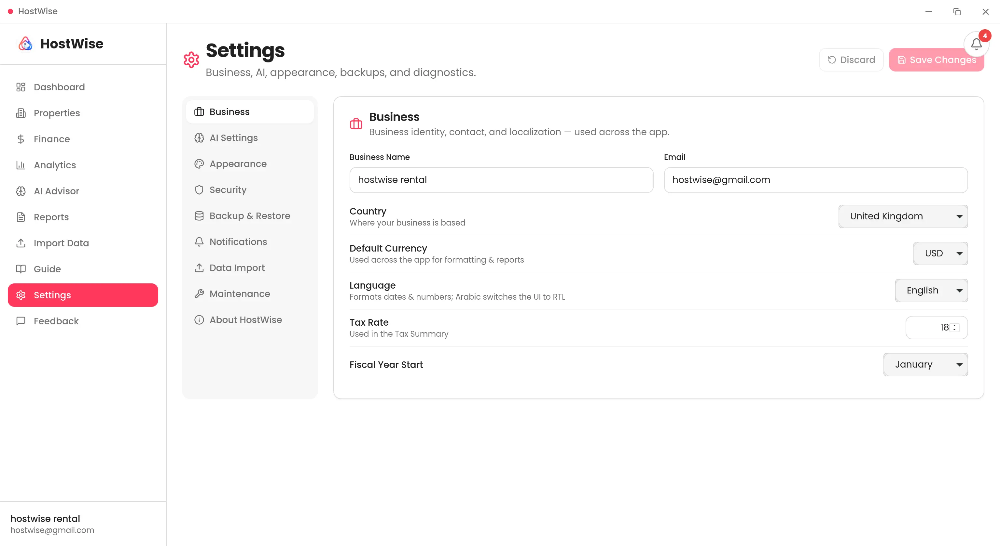 | 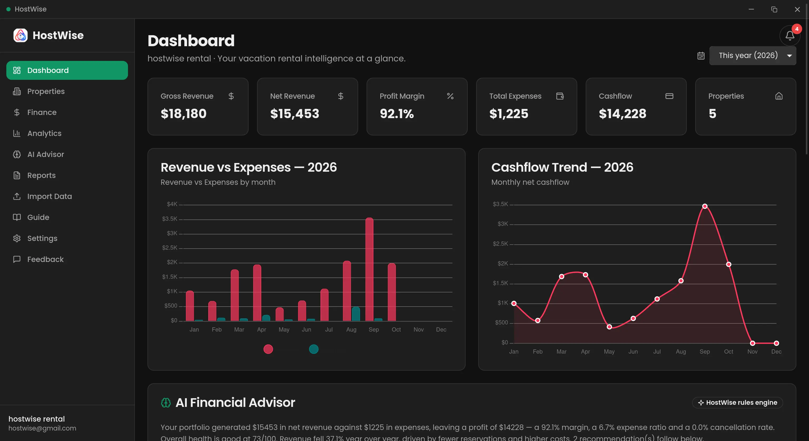 |

---

## ✨ Elite Features ⭐

### AI Financial Advisor (rules + BYOK LLM)
Not just dashboards — **actionable intelligence**. The built-in rule engine runs **offline and free** by default and generates structured recommendations:

```
Type: Warning
Cause: "Villa Azur net revenue decreased 22% vs last month"
Business Impact: "Estimated $1,240 monthly loss at current trajectory"
Suggested Action: "Increase minimum stay to 3 nights and adjust pricing +8% on weekends"
Confidence: 0.85
```

Power users can plug in their **own LLM key** (OpenAI / Anthropic / DeepSeek-compatible / Ollama) through Settings — the AI then writes richer executive summaries while **metrics always come from your real data**. No key? The rules engine keeps working.

### Native Rust Backend, Embedded In-Process
The entire API server (axum + sqlx/SQLite) is **compiled into the desktop binary**. One executable, no sidecar process, no Python runtime, no port conflicts (it binds a free port automatically).

### Auto-Calculated KPIs
Revenue, expenses, cashflow, margins — computed in real time, never stored redundantly. Every number is traceable to its source.

### Health Scores That Don't Lie
Portfolio and per-property scorers return an honest **"no data yet"** instead of fabricating a neutral score on an empty database.

### Idempotent Import
Re-importing the same CSV or iCal feed **skips duplicates** (natural-key dedupe) instead of corrupting your books.

### Modular Monolith
Self-contained domains (properties, finance, analytics, AI, reports, connectors) with clear boundaries — simple enough for one dev, structured enough for a team. Soft deletes + `sync_id` on every row make future cloud sync a schema-compatible step.

---

## 🛠 Technology Stack

| Layer | Technology |
|---|---|
| **Desktop shell** | Tauri v2 (Rust) — small binaries, native webview |
| **Frontend** | Next.js 14 (App Router), TypeScript, TailwindCSS, shadcn/ui, Chart.js + react-chartjs-2, TanStack Query |
| **Backend** | Rust — axum, sqlx, tokio, tower-http (CORS/tracing), compiled in-process |
| **Database** | SQLite (single file, WAL mode) — no server required |
| **PDF Reports** | `printpdf` (Rust) — no external runtime |
| **AI Engine** | Rule-based engine (offline) + BYOK LLM proxy (OpenAI / Anthropic / DeepSeek / Ollama) |
| **Data Import** | Pure-Rust CSV (`csv` + `encoding_rs`) and iCal (dependency-free VEVENT parser) |
| **CI/CD** | GitHub Actions — Windows (NSIS), macOS (dmg), Linux (deb + AppImage) |

---

## ⚙️ Architecture

```
┌──────────────────────────────────────────────────────┐
│                Tauri v2 Desktop App (Rust)            │
│                                                      │
│  ┌────────────────────────────┐  ┌────────────────┐  │
│  │  Next.js Frontend (webview) │  │  Rust Backend  │  │
│  │  static export, client-side │──▶│  axum, in-proc │  │
│  └────────────────────────────┘  │  /api/v1/*     │  │
│                                  └───────┬────────┘  │
│                                          │ sqlx      │
│                                  ┌───────▼────────┐  │
│                                  │ SQLite (1 file) │ │
│                                  └────────────────┘  │
└──────────────────────────────────────────────────────┘
        ▲  HTTP /api/v1 (localhost, CORS-scoped)
        │
   Host CSV / iCal exports  ──▶  Connector → normalize → import
```

**Data flow**

```
CSV / iCal upload → Connector normalizes + dedupes → SQLite (sync_id on every row)
                                                          ↓
Dashboard / Analytics  →  Query-computed KPIs  →  Chart.js visualizations
                                                          ↓
AI engine analyzes → rule-based detection (or BYOK LLM) → recommendations + reports
```

**Repository layout (monorepo)**

```
app/frontend/   Next.js UI + Tauri shell (src-tauri/)
app/backend/    Rust backend (axum + sqlx/SQLite), path-dep of src-tauri
landing/        Marketing website (Next.js)
packaging/      Distribution: aur/ (Arch), windows/, linux/
docs/           Architecture, operations, decisions, changelog
scripts/        Build / release / automation (release.sh, aur-release.sh, …)
.github/        CI/CD (release.yml, ci.yml)
```

---

## 🧠 Development Journey

### Biggest Challenges

**1. Financial calculation accuracy**
Revenue and expense tracking for vacation rentals is more complex than it seems — partial refunds, platform commissions, cleaning fees, taxes. HostWise normalizes everything into a `Revenue`/`Expense` model and computes net figures at query time, so every number is traceable.

**2. Making AI useful, not gimmicky**
Instead of jumping straight to an LLM (expensive, unpredictable, sends data off-device), HostWise ships a deterministic **rule-based engine** with structured output (`cause`, `impact`, `action`, `confidence`) that runs offline. The interface is deliberately **LLM-swappable** — same output schema, different brain — so BYOK is an upgrade, not a rewrite.

**3. The native Rust rewrite**
The backend started as Python/FastAPI, then was rewritten as a **single Rust binary** (axum + sqlx/SQLite) embedded in the Tauri app. No Python runtime, no PyInstaller, no sidecar — faster startup, smaller footprint, and a self-contained executable on every OS.

**4. Shipping a working AppImage**
The CI "succeeded" but the Linux AppImage crashed on real GPUs (`Could not create default EGL display: EGL_BAD_PARAMETER`) because Tauri bundles an old WebKitGTK. The fix: repack the AppImage to use the **system** WebKitGTK (exactly like the `.deb`), then re-sign it. Now a broken AppImage can't silently pass CI.

### Interesting Technical Decisions

- **Modular monolith over microservices** — one process, one DB transaction; domain boundaries enforced by package structure, not network calls
- **Rule-based AI first, LLM second** — deterministic, free, offline; BYOK adds depth without removing the safety net
- **Query-computed KPIs** — never store derived data; always compute from the source of truth
- **Soft deletes + `sync_id` everywhere** — financial audit trail and a schema-compatible path to optional cloud sync
- **SQLite over PostgreSQL for the desktop product** — zero infrastructure, automatic backups, one file the user owns

---

## 📚 What I Learned

### Technical
- Rust + axum + sqlx produce a small, fast, dependency-light backend with excellent compile-time safety
- Tauri v2 webviews need explicit CORS for every packaged origin (`tauri://localhost`, `http://tauri.localhost`, …)
- Static Next.js export + client-side rendering keeps the desktop bundle simple and portable
- TanStack Query removes most server-state boilerplate in the React app

### Architecture
- Domain-driven design works beautifully in a monolith — package boundaries *are* domain boundaries
- Design interfaces before implementations (the connector interface paid off when adding iCal)
- A local-first product must treat "no data yet" as a first-class state, not a fake neutral score

### Problem Solving
- "What's the simplest thing that works?" beats "What's the most scalable architecture?" at this stage
- Financial software demands correctness over cleverness — every KPI must be traceable
- Green CI ≠ working software: a best-effort build step can hide a broken artifact (the AppImage lesson)

---

## ⚡ Getting Started

### Prerequisites

| Tool | Version | Notes |
|---|---|---|
| **Rust** | 1.77.2+ | stable toolchain (`rustc`, `cargo`) |
| **bun** | 1.x | frontend install / build / dev / tauri |
| **git** | — | clone the repo |

Linux desktop deps (Debian/Ubuntu):

```bash
sudo apt update
sudo apt install -y libwebkit2gtk-4.1-dev build-essential curl wget file \
  libxdo-dev libssl-dev libayatana-appindicator3-dev librsvg2-dev patchelf
```

macOS/Windows need no extra system packages.

### Option A — Desktop app (recommended)

```bash
cd app/frontend
bun install          # first time only
bun run tauri:dev    # opens the native app window
```

The Tauri shell starts the Rust backend **in-process** on a free port and tells the frontend the real URL — port collisions never matter.

### Option B — Web / browser dev mode

```bash
cd app/frontend
bun install          # first time only
bun run dev:app      # starts app/backend (cargo run, :8000) + Next dev (:3000)
```

Or in two terminals:

```bash
# Terminal 1 — Rust backend (start FIRST) → http://127.0.0.1:8000
cd app/backend
cargo run

# Terminal 2 — Next.js dev server → http://localhost:3000
cd app/frontend
bun install          # first time only
bun run dev
```

### Backend only / API testing

```bash
cd app/backend
cargo run                       # http://127.0.0.1:8000

curl http://127.0.0.1:8000/api/health   # → {"database":"up","status":"ok",…}

cargo test                  # domains, analytics, connectors, AI/reports suites
```

### Environment Variables

All optional; a `app/backend/.env` file is supported.

| Variable | Default | Purpose |
|---|---|---|
| `PORT` | `8000` | HTTP port |
| `HOST` | `127.0.0.1` | Bind address |
| `SQLITE_PATH` | `<data_dir>/hostwise.db` | SQLite database file |
| `HOSTWISE_DATA_DIR` | `<data_dir>` | Backups + uploads live here |
| `CORS_ORIGINS` | dev: `["http://localhost:3000"]`; desktop: `["tauri://localhost","http://tauri.localhost","https://tauri.localhost"]` | Allowed origins |
| `APP_NAME` / `APP_VERSION` / `ENVIRONMENT` | `HostWise` / `0.8.2` / `development` | Metadata; `ENVIRONMENT=production` enables the automatic startup backup |
| `OPENAI_API_KEY` / `ANTHROPIC_API_KEY` | *(empty)* | Optional BYOK AI providers |

> **Gotcha:** a stale `PORT` env var makes the backend bind the wrong port → "Could not connect to the backend." `unset PORT` before running.

### Data lives on your device

| OS | Data directory |
|---|---|
| Linux | `~/.local/share/hostwise` |
| macOS | `~/Library/Application Support/hostwise` |
| Windows | `%APPDATA%\hostwise` |

Inside: `hostwise.db` (WAL), `backups/` (automatic daily + manual), `uploads/` (import staging), `logs/`.

### Production build (installers)

```bash
cd app/frontend
bun install --frozen-lockfile
bun run build                     # Next.js static export → out/
bunx tauri build --bundles nsis   # Windows
bunx tauri build --bundles dmg    # macOS
bunx tauri build --bundles deb    # Linux (.deb)
bunx tauri build --bundles appimage  # Linux (repacked to use system WebKitGTK)
```

CI builds all three platforms on a `v*` tag push and publishes installers + the updater manifest to a GitHub Release.

---

## 🖼 Screenshots

<p align="center">
  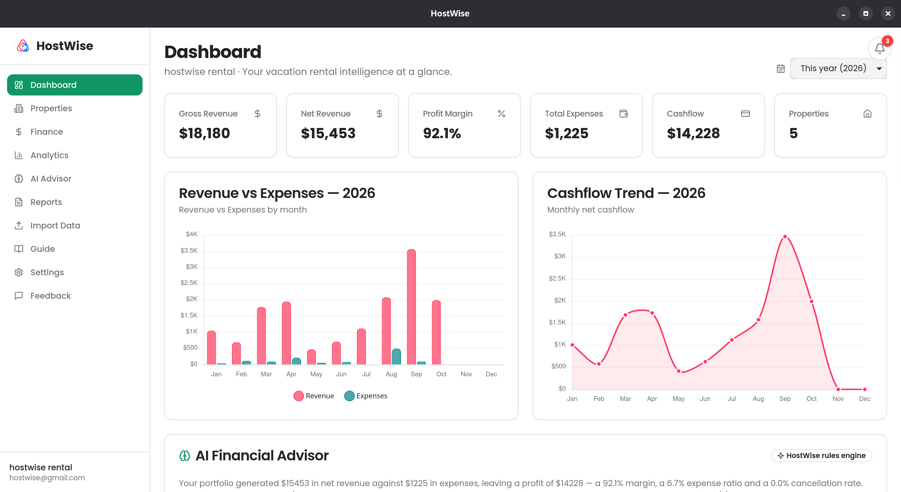
  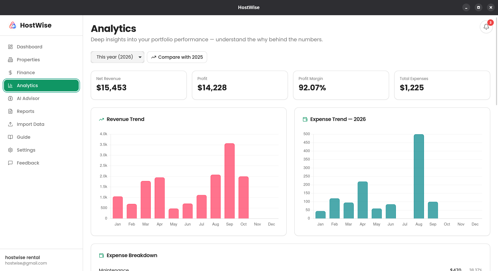
  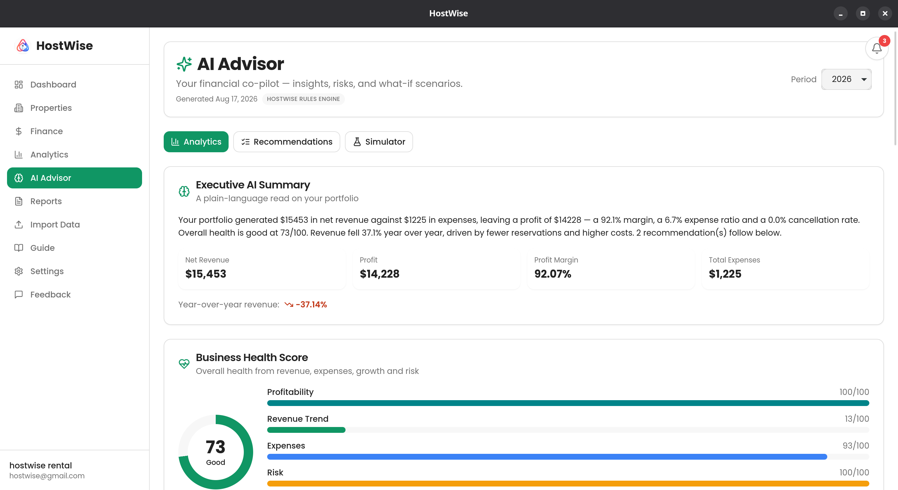
  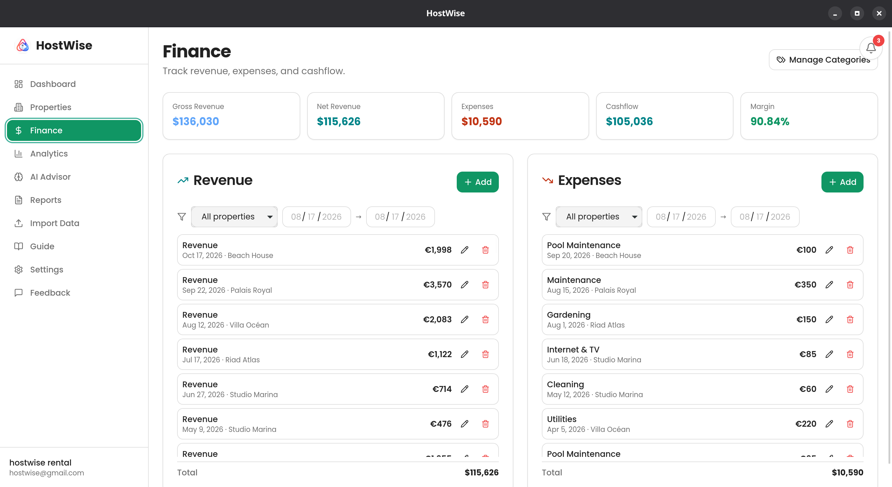
  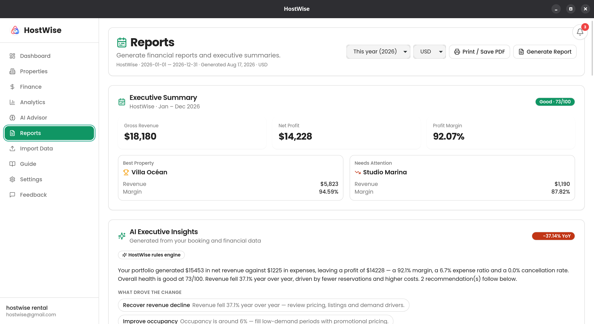
  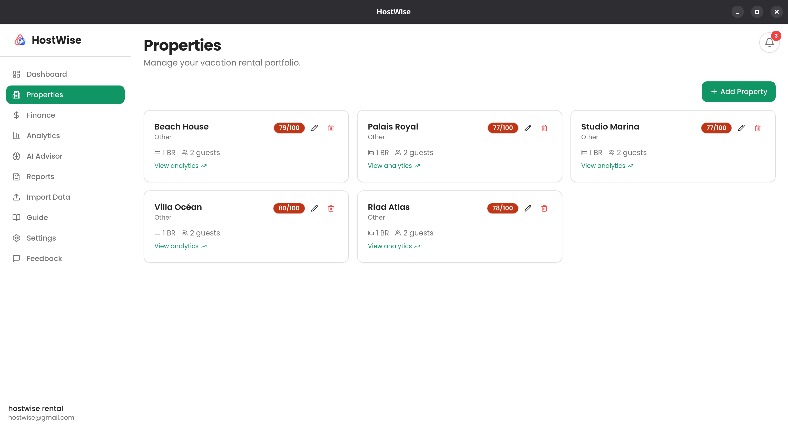
  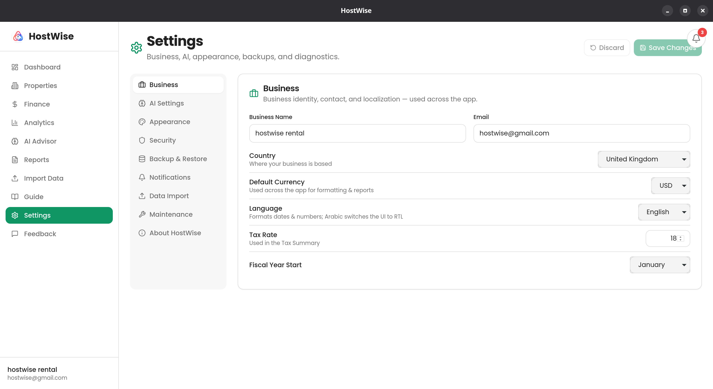
</p>

---

## 🔮 Roadmap

**Done** ✅ — CSV + iCal import (idempotent), notifications engine, BYOK LLM, category management, health scores, PDF reports, automatic backups, native Rust backend, Tauri desktop packaging (Win/macOS/Linux), e2e harness.

**Next / planned:**
- Email delivery of scheduled reports
- Optional cloud sync (schema already has `sync_id` on every table)
- Official Airbnb/Booking/VRBO API connectors where they exist (iCal is the supported host-accessible path today)
- Column-mapping wizard for imports
- Advanced tax/accounting export + owner statements
- Licensing, mobile, and team features as the product grows

> See `docs/planning/roadmap.md` for the full phase-classified roadmap, and `docs/` for architecture, operations, and decision records.

---

## 📄 License

Proprietary — HostWise. All rights reserved. See `LICENSE`.

---

## 👨‍💻 Author

Built with the philosophy:

> *"Build for the first customer, not the millionth."*
>
> The local application is the product. The cloud is an optional enhancement.
> Product quality and customer value always come before infrastructure complexity.

---

<p align="center">
  <b>HostWise</b> — Own your data. Know your numbers. Grow your portfolio.
</p>
