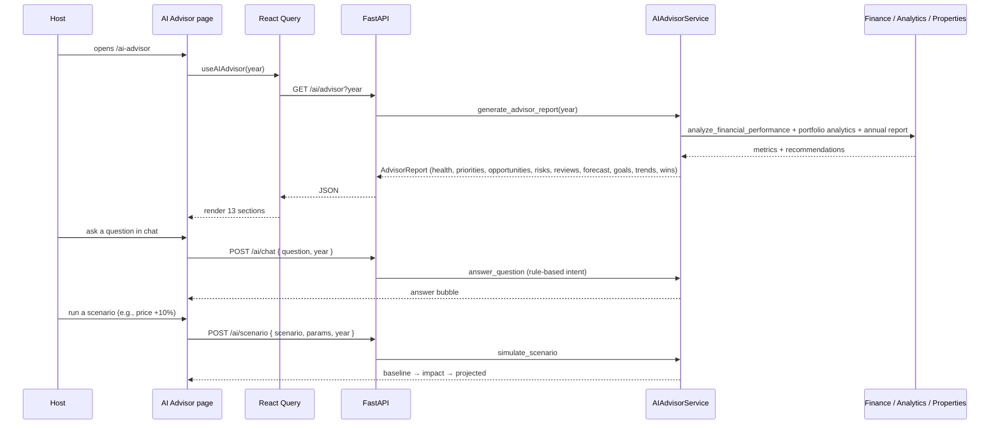

# AI Advisor Audit (`/ai-advisor`)

## Purpose

> **v2 update:** The page is organized into **tabs** — Analytics,
> Recommendations, Chat, and Simulator. Occupancy references were removed from
> all advisor sections (risks now flag on revenue trend / margin / health; the
> forecast has no expected-occupancy card; the simulator’s allowed scenarios are
> `price_increase`, `hire_cleaner`, `expense_reduction`, `minimum_stay`). Chat
> supports **BYOK**: when `ai_api_key` is set, answers come from the configured
> LLM (`mode: "llm"`); otherwise the rules engine answers (`mode: "rules"`).

The AI Advisor page is the **financial co-pilot** — the flagship differentiator
of HostWise. It exists so a host can move from *"I see the numbers"* to *"I
know what to do."* Where Reports documents performance, the Advisor *reasons*
about it: it prioritizes actions, quantifies opportunities and lost revenue,
flags risks per property, explains trends, forecasts the next 30 days, answers
questions in natural language, and lets the host simulate "what if" scenarios.

The intended user is the **owner/operator** who wants actionable guidance, not
just dashboards.

## Business Objective

After visiting, the user should be able to decide:
- **What to fix first** (Priority Action Center: critical/medium/low).
- **Where the upside is** (Opportunities + lost revenue).
- **Which property is at risk** and why.
- **What next month looks like** (forecast).
- **Whether a price change / hiring a cleaner is worth it** (scenario
  simulator).

## Workflow



## Components

| Component | Responsibility |
| --- | --- |
| `AIHeader` | Title + year selector |
| `ExecutiveAISummary` | Narrative summary + current metrics |
| `BusinessHealthScore` | 0–100 ring + component bars (revenue/expenses/growth/risk) |
| `PriorityActions` | Grouped critical/medium/low actions with confidence |
| `Opportunities` | Potential revenue + actions; lost-revenue card |
| `RiskDetection` | Per-property high/medium risk cards |
| `PropertyReviews` | Per-property AI summary, strengths/weaknesses, suggested action |
| `ForecastNext30` | Expected revenue/occupancy/risk/best property |
| `TrendExplanations` | "Why it happened" reasons per KPI |
| `RecommendedGoals` | Occupancy/ADR/cleaning/revenue targets with progress |
| `AIChat` | Natural-language Q&A with suggested questions + typing indicator |
| `ScenarioSimulator` | What-if controls + baseline/impact/projected comparison |
| `Achievements` | Wins (best month, margin, expense reduction) |

## Hooks

- `useAIAdvisor(year)` — one query for the whole dashboard.
- `useAIChat()` — mutation (`POST /ai/chat`).
- `useAIScenario()` — mutation (`POST /ai/scenario`).

## API Calls

| Endpoint | Why |
| --- | --- |
| `GET /ai/advisor?year` | Composed advisor dashboard (the page's single source of truth). |
| `POST /ai/chat` | Interactive Q&A over the same data (rule-based intent engine). |
| `POST /ai/scenario` | What-if financial simulation. |

## State Management

- Server state: React Query for the dashboard; mutations for chat/scenario.
- Local state: chat message history, scenario inputs, chat typing.
- The chat is session-local (messages not persisted) — deliberate.

## User Journey

```
Open /ai-advisor
  ↓
Executive summary + business health score
  ↓
Priority actions (what to fix first)
  ↓
Opportunities + money left on the table
  ↓
Risk detection per property
  ↓
Property AI reviews
  ↓
Next 30 days forecast
  ↓
Ask the AI: "Which expenses should I reduce?" → actionable answer
  ↓
Simulate: "Increase prices 10%?" → see projected profit
  ↓
Decision: adopt the scenario with the best projected outcome
```

## Relation With Other Pages

- **Dashboard:** shows a condensed slice of the advisor's recommendations.
- **Reports:** AI Insights in reports reuse the same `AIAdvisorService` — the
  Advisor is the "live/interactive" form, Reports is the "documented" form.
- **Analytics:** the advisor reasons over the same operating KPIs.
- **Finance/Properties:** recommendations map to concrete records (expenses to
  cut, properties to promote).
- **Settings:** `ai_*` settings (enabled, level, language) are the knobs for
  this page.

## Architectural Decisions

- **Rule-based engine with an LLM-ready interface** — deterministic, private,
  offline, and swappable (see Decision Log #5).
- **Structured outputs** (`cause/impact/action/confidence`) — the UI renders
  them consistently and an LLM can fill the same shape later.
- **One dashboard endpoint** — composition on the backend.
- **Chat & scenario as separate POST endpoints** — interactive, stateful
  requests isolated from the read dashboard.
- **Reuses the same aggregation services as Reports** — consistency between
  what the advisor says and what the report shows.

## Strengths

- Differentiating product surface (chat + scenarios + priorities are not
  "just charts").
- Explainable, deterministic AI (confidence scores, "why it happened").
- The LLM seam means the flagship feature can be upgraded without a rewrite.

## Weaknesses

- Rule engine is narrow — answers are only as good as the intents that exist.
- Chat recomputes the **entire advisor report per question** (expensive on
  large portfolios).
- Hardcoded € in backend AI strings; not yet driven by settings currency.

## Technical Debt

- Nested recomputation (analyze → portfolio → per-property health → per-property
  analytics).
- No caching of advisor results; chat latency scales with data size.
- Chat state is lost on navigation (acceptable for MVP, could persist later).

## Future Evolution

- Swap/add LLM providers (OpenAI/Claude/Ollama) behind the same interface;
  keep rules as the offline fallback.
- Cheap per-intent data path + caching for chat.
- Persistent conversation history; "ask about a specific property".
- Scenario sensitivity analysis (multi-parameter what-if).
- Honor `ai_analysis_level` and `ai_language` settings in the generator.
