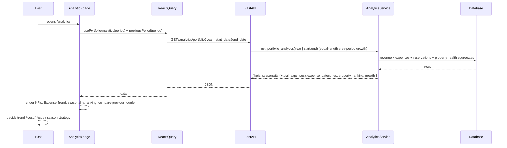

# Analytics Audit (`/analytics`)

## Purpose

> **v2 update:** Occupancy/ADR/RevPAR are **removed** from the product. The page
> is **period-driven** — a period selector picks a year or a **custom date
> range**, and the KPIs, **Expense Trend**, seasonality, and property ranking
> all follow it. A **“Compare with previous period”** toggle shows the
> equal-length preceding window (not just YoY). The occupancy heatmap and
> ADR/RevPAR cards are gone; the Expense Trend chart pairs monthly revenue with
> monthly expenses.

The Analytics page exists to answer the **"why"** behind portfolio
performance — the page subtitle literally says *"understand the why behind the
numbers."* While the Dashboard answers "how are we doing," Analytics answers:

- *Is occupancy healthy?*
- *Is my pricing (ADR) right relative to occupancy (RevPAR)?*
- *Which months are strong/weak (seasonality)?*
- *Which property outperforms, and which needs attention?*

The intended user is the **owner/operator or manager** doing a periodic
(weekly/monthly) performance review.

## Business Objective

After visiting, the user should be able to decide:
- **Trends:** is revenue growing or falling vs the previous period?
- **Costs:** where are expenses trending (Expense Trend)?
- **Focus:** which property to investigate or replicate.
- **Seasonality:** which months are strong/weak — where to adjust pricing/marketing.

## Workflow



## Components

| Component | Responsibility | Notes |
| --- | --- | --- |
| `AnalyticsContent` | Period picker + data fetch + sort state + composition | Period = year or custom range; local `useState` for sort |
| KPI cards | Net Revenue, Profit Margin, Avg Revenue per Property, Property Count | Period-scoped; “Compare with previous period” toggle |
| Expense Trend chart | Monthly revenue + expenses (Chart.js) | Uses `seasonality.total_expenses` |
| Seasonality / Property Ranking | Monthly revenue bars + sortable property table | Client-side sort |
| Best / Needs Attention cards | Top/bottom performer | Same data as table |

## Hooks

- `usePortfolioAnalytics(period)` — the only server query (accepts a `ReportPeriod`
  of `{year}` or `{start,end}`).
- `previousPeriod(period)` from `lib/report-period.ts` — computes the equal-length
  preceding window for the “Compare with previous period” view.
- Local `useState` for `sortField` / `sortDir` (client-side sorting — the data
  set is small, so no server sort needed).

## API Calls

| Endpoint | Why |
| --- | --- |
| `GET /analytics/portfolio?year \| start_date&end_date` | Everything the page shows derives from this one call: period KPIs + growth, seasonality (with `total_expenses` per month), expense categories, property ranking, health distribution. |

This is an excellent example of the **"one endpoint per page"** philosophy:
the backend composes the analytics payload so the frontend stays a pure
presentation layer.

## State Management

- Server state: React Query (`["portfolio-analytics", year]`).
- Local UI state: sort field/direction only.
- No context used — the page is self-contained.

## User Journey

```
Open /analytics
  ↓
Pick a year or custom range; optionally compare with the previous period
  ↓
KPIs (net revenue, margin, avg/property, property count)
  ↓
Expense Trend + monthly revenue → spot cost spikes and seasonality
  ↓
Compare properties (sort by margin, revenue, health)
  ↓
Best performer vs "needs attention"
  ↓
Decision: adjust pricing / investigate bottom property / budget for cost spikes
```

## Relation With Other Pages

- **Dashboard:** the Property Ranking card is this page's teaser.
- **AI Advisor:** the same `get_portfolio_analytics` feed powers the AI's
  health scores, risks, and reviews — Analytics is the "raw" view of the data
  the AI reasons over.
- **Reports:** property performance tables in reports reuse the same
  underlying revenue/expense/property aggregation.
- **Finance / Properties:** the operational metrics are computed from
  reservations (booking data) and financial records.

## Architectural Decisions

- **One aggregated endpoint per page** — the backend owns composition; the
  frontend renders.
- **Computed on demand** — seasonality, ADR, RevPAR are recomputed from raw
  reservation rows every request (never stored).
- **Client-side sorting** — fine for tens of properties; avoids server round
  trips.

## Strengths

- Maps directly to the three operating levers a host controls (price,
  occupancy, mix of properties).
- Strong seasonality visualization (heatmap).
- Sortable comparison table with health scores.

## Weaknesses

- **Hardcoded/fake ADR & RevPAR trend arrays** (`[95, 101, 118, ...]`) — the
  chart shows fabricated data, which is misleading and must be replaced.
- Occupancy heatmap uses reservation *counts* as a proxy, not true occupied
  nights — could mislead if stays vary in length.
- Only current year; no year-over-year or period comparison on this page.

## Technical Debt

- Fake trend data (highest priority to fix).
- No month filter / no date-range selector.

## Future Evolution

- Replace fake arrays with a real `GET /analytics/portfolio` monthly ADR/RevPAR
  series (the analytics service already computes monthly revenue — add monthly
  nights → ADR/RevPAR per month).
- Add period comparison (this year vs last year, season-over-season).
- Add per-property drill-down (analytics service already has
  `get_property_analytics`).
- Add export (CSV) of the comparison table.
