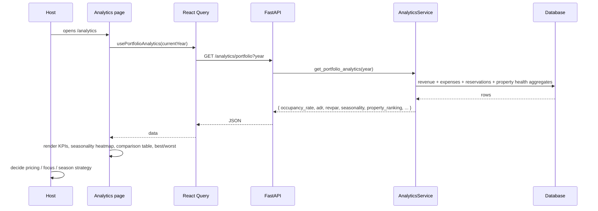

# Analytics Audit (`/analytics`)

## Purpose

> **v2 update:** Occupancy/ADR/RevPAR were **removed** from the product. The page
> now leads with profit-driven KPIs (revenue, profit, margin, expenses), a **year
> selector**, and a **“Compare with {year-1}”** YoY toggle on KPIs and the property
> table. The occupancy heatmap and ADR/RevPAR cards are gone.

The Analytics page exists to answer the **"why"** behind portfolio
performance — the page subtitle literally says *"understand the why behind the
numbers."* While the Dashboard answers "how are we doing," Analytics answers:

- *Is occupancy healthy?*
- *Is my pricing (ADR) right relative to occupancy (RevPAR)?*
- *Which months are strong/weak (seasonality)?*
- *Which property outperforms, and which needs attention?*

The intended user is the **owner/operator or manager** doing a periodic
(weekly/monthly) performance review.

## Business Objective

After visiting, the user should be able to decide:
- **Pricing:** should ADR go up/down given occupancy?
- **Focus:** which property to investigate or replicate.
- **Seasonality:** where to adjust pricing/marketing by month.

## Workflow



## Components

| Component | Responsibility | Notes |
| --- | --- | --- |
| `AnalyticsContent` | Data fetch + sort state + composition | Local `useState` for sort field/direction |
| KPI trend cards | Net Revenue, Occupancy, ADR, RevPAR | Four headline operating metrics |
| Revenue Trend chart | Monthly revenue (Chart.js) | Reuses `RevenueBarChart` |
| Occupancy Heatmap | Per-month reservation count bars | Color-scaled by demand |
| ADR vs RevPAR card | Comparison of the two rate metrics | ⚠️ currently uses **hardcoded arrays** |
| Property Comparison table | Sortable ranking (revenue/margin/occupancy/score) | Client-side sort |
| Best / Needs Attention cards | Top/bottom performer | Same data as table |

## Hooks

- `usePortfolioAnalytics(year)` — the only server query.
- Local `useState` for `sortField` / `sortDir` (client-side sorting — the data
  set is small, so no server sort needed).

## API Calls

| Endpoint | Why |
| --- | --- |
| `GET /analytics/portfolio?year` | Everything the page shows derives from this one call: operating KPIs, seasonality, ranking, health distribution. |

This is an excellent example of the **"one endpoint per page"** philosophy:
the backend composes the analytics payload so the frontend stays a pure
presentation layer.

## State Management

- Server state: React Query (`["portfolio-analytics", year]`).
- Local UI state: sort field/direction only.
- No context used — the page is self-contained.

## User Journey

```
Open /analytics
  ↓
Operating KPIs (revenue, occupancy, ADR, RevPAR)
  ↓
Monthly revenue + occupancy heatmap → spot seasonality
  ↓
Compare properties (sort by margin, occupancy, health)
  ↓
Best performer vs "needs attention"
  ↓
Decision: adjust weekend pricing / investigate bottom property
```

## Relation With Other Pages

- **Dashboard:** the Property Ranking card is this page's teaser.
- **AI Advisor:** the same `get_portfolio_analytics` feed powers the AI's
  health scores, risks, and reviews — Analytics is the "raw" view of the data
  the AI reasons over.
- **Reports:** property performance tables in reports reuse the same
  underlying revenue/expense/property aggregation.
- **Finance / Properties:** the operational metrics are computed from
  reservations (booking data) and financial records.

## Architectural Decisions

- **One aggregated endpoint per page** — the backend owns composition; the
  frontend renders.
- **Computed on demand** — seasonality, ADR, RevPAR are recomputed from raw
  reservation rows every request (never stored).
- **Client-side sorting** — fine for tens of properties; avoids server round
  trips.

## Strengths

- Maps directly to the three operating levers a host controls (price,
  occupancy, mix of properties).
- Strong seasonality visualization (heatmap).
- Sortable comparison table with health scores.

## Weaknesses

- **Hardcoded/fake ADR & RevPAR trend arrays** (`[95, 101, 118, ...]`) — the
  chart shows fabricated data, which is misleading and must be replaced.
- Occupancy heatmap uses reservation *counts* as a proxy, not true occupied
  nights — could mislead if stays vary in length.
- Only current year; no year-over-year or period comparison on this page.

## Technical Debt

- Fake trend data (highest priority to fix).
- No month filter / no date-range selector.

## Future Evolution

- Replace fake arrays with a real `GET /analytics/portfolio` monthly ADR/RevPAR
  series (the analytics service already computes monthly revenue — add monthly
  nights → ADR/RevPAR per month).
- Add period comparison (this year vs last year, season-over-season).
- Add per-property drill-down (analytics service already has
  `get_property_analytics`).
- Add export (CSV) of the comparison table.
