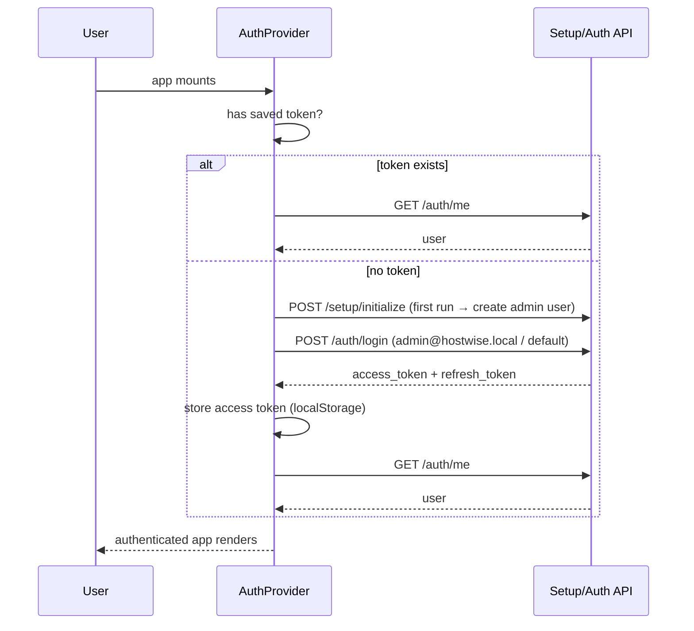

# Authentication Audit

> **v2 update: RETIRED.** The product is now fully **auth-free**. There is no
> login screen, no default credentials, and no JWT dependency in any router.
> Identity is captured during onboarding (`profile_name` / `profile_email` stored
> as settings via `POST /setup/initialize`) and the frontend `auth-context`
> derives the user from settings. The backend `auth` module and `/auth` routes are
> kept for compatibility but are unused by the UI. See [decision-log.md](./decision-log.md) §0.1.

## Purpose

Authentication exists to protect the user's financial data and to provide a
security architecture that can grow. In the MVP, HostWise is **local-first and
single-user**, so the UX is deliberately *no login screen* — but the auth
machinery (JWT, bcrypt, refresh tokens, roles) is fully implemented so that
multi-user and cloud modes can be switched on without rework.

The intended user is the **single owner** (auto-logged-in) today, and
**multiple users with roles** (admin/owner/manager/viewer) in the future.

## Business Objective

- Protect data at rest and in transit (tokens over HTTP).
- Let the app "just work" for the owner (auto-login).
- Provide the role model (`UserRole`) needed when teams or agencies arrive.

## Workflow (frontend bootstrap)

## Backend domain

| Layer | Files | Responsibility |
| --- | --- | --- |
| Model | `auth/models.py` | `User` (email unique, hashed_password, full_name, is_active, is_verified, avatar) + `UserRole` enum |
| Security | `auth/security.py` | bcrypt hash/verify; JWT create/decode (access + refresh) |
| Repository | `auth/repository.py` | `UserRepository` (by email, email_exists) |
| Service | `auth/service.py` | register/login/refresh/get_current_user business rules |
| Schemas | `auth/schemas.py` | DTOs (login/register/token/user response) |
| Dependencies | `auth/dependencies.py` | `get_current_user` — parses Bearer token, loads user, raises 401 |
| Router | `auth/router.py` | `/register`, `/login`, `/refresh`, `/me` |

## Security design

- Passwords hashed with **bcrypt** (never stored in plain text).
- **Access tokens** (short-lived, `type: "access"`) + **refresh tokens**
  (longer-lived, `type: "refresh"`) using python-jose.
- Every protected endpoint depends on `get_current_user`, which validates the
  token type, expiry, and that the user still exists and is active.
- Roles are defined (`UserRole`) but not yet enforced by authorization
  checks — a known, deliberate gap for MVP.

## API Calls

| Endpoint | Why |
| --- | --- |
| `POST /auth/register` | Create an account (used by UI-less flows / future signup). |
| `POST /auth/login` | Exchange credentials for tokens. |
| `POST /auth/refresh` | Rotate tokens from a valid refresh token. |
| `GET /auth/me` | Current user (the frontend's identity source). |
| `POST /setup/initialize` | First-run provisioning of the default admin user (not auth, but part of the bootstrap). |

## Strengths

- Real security primitives (bcrypt, JWT, refresh tokens, roles) behind a
  frictionless MVP UX.
- `get_current_user` is applied consistently across write endpoints and the
  import/backup flows.
- The role enum + token `type` claim make multi-user activation a config
  change, not a rewrite.

## Weaknesses / Technical Debt

- The frontend stores **only the access token** and does not implement refresh
  rotation (tokens are effectively long-session).
- Auto-login uses a **default password** and a hardcoded `localhost:8000` in
  `auth-context` (breaks in the packaged app if the port differs — mitigated by
  Tauri dynamic ports, but should route through the dynamic base URL).
- No logout / session revocation UI.
- `UserRole` exists but no authorization enforcement (any logged-in user can do
  anything).

## Future Evolution

- Enforce role-based access control (admin/owner/manager/viewer).
- Implement refresh-token rotation on the frontend + logout/revocation.
- Real account creation/onboarding UI, password change, 2FA.
- Multi-tenant: bind users to an `organizations` tenant (the `business_name`
  setting is the seed).
