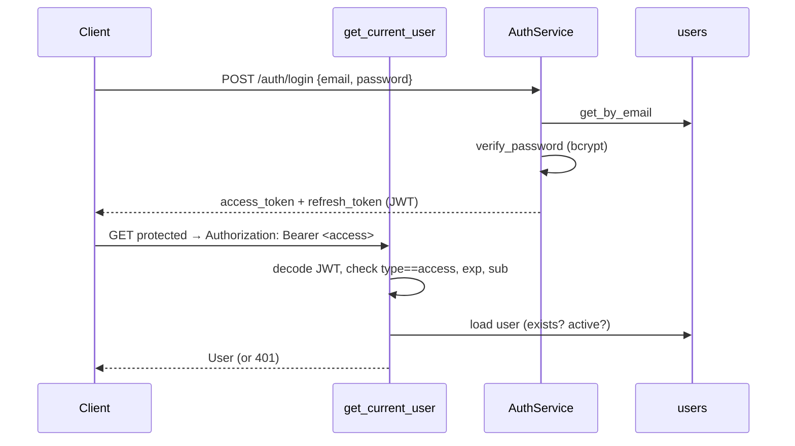

# Backend — Auth Domain (`app/auth/`)

## Purpose

The Auth domain protects the platform's financial data and provides the
identity + role model the product will need as it grows beyond the single
local owner. In the MVP it is deliberately **frictionless** (auto-login), but
the security primitives are production-grade so that multi-user and cloud modes
are a configuration change, not a rewrite.

## Architecture

```
auth/
  models.py        # User + UserRole
  schemas.py       # DTOs (register/login/token/user)
  repository.py    # UserRepository
  security.py      # bcrypt + JWT utilities
  service.py       # AuthService (register/login/refresh/me)
  dependencies.py  # get_current_user (the guard)
  router.py        # /auth/*
```

## Security flow



## Security primitives (`security.py`)

- **bcrypt** hashing/verification (never store plain text).
- **JWT** (python-jose, HS256) access tokens (short-lived) + refresh tokens
  (longer-lived), each tagged `type: access|refresh` so tokens can't be
  misused across flows.
- Timezone-aware UTC for `iat`/`exp` (the codebase is Python 3.10 compatible;
  `datetime.UTC` was replaced with `timezone.utc`).

## Business rules

| Rule | Where |
| --- | --- |
| Email uniqueness + lowercase normalization | `AuthService.register` |
| Reject inactive users at login/refresh/me | `AuthService`, `dependencies` |
| Refresh tokens must be `type: refresh`; invalid → 401 | `AuthService.refresh_token` |
| Access tokens must be `type: access` | `dependencies.get_current_user` |

## Guard (`get_current_user`)

The single FastAPI dependency used by every protected endpoint (finance writes,
properties, connectors, backups). It:
1. Parses the `Authorization: Bearer <token>` header.
2. Decodes + validates type/expiry/sub.
3. Loads the user and checks `is_active`.
4. Returns the `User` or raises 401.

This centralizes authentication so endpoints never re-implement token logic.

## Communication with other domains

- `dependencies.get_current_user` is imported by **finance, properties,
  connectors** routers to protect writes.
- **Setup** (`setup_router.py`) creates the default admin user on first run
  (the bootstrap that makes auto-login work).
- It is the **only** domain other domains depend on for security — no domain
  implements its own auth.

## Strengths

- Production-grade primitives behind a frictionless UX.
- Centralized guard, consistent across endpoints.
- Role enum ready for future authorization.

## Weaknesses / Debt

- `UserRole` defined but **not enforced** — any authenticated user has full
  access (fine for single-user MVP, must be addressed before multi-user).
- No refresh-token rotation on the client; frontend stores only the access
  token.
- Default admin password (`hostwise_default`) is only a stopgap; the Settings
  "Change Password" action is a placeholder.
- No rate limiting / lockout on login (settings expose a rate-limit value but
  it's not wired).

## Future evolution

- Enforce RBAC (admin/owner/manager/viewer) across endpoints.
- Refresh rotation + logout/revocation; session management API.
- Password change, 2FA, email verification.
- Multi-tenant binding (users → organizations).
- Wire the configured rate limit into login.
