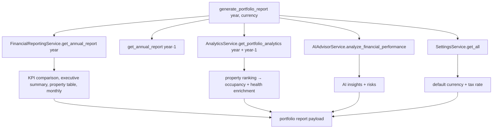

# Backend — Reports Domain (`app/reports/`)

## Purpose

The Reports domain is the **professional documentation engine**. It turns the
aggregated financial/analytics/AI data into structured, presentable reports —
weekly, monthly, annual, executive, and the comprehensive **portfolio report**
that powers the Reports page.

It exists because hosts need to hand performance evidence to owners, partners,
and accountants. The portfolio report is the domain's flagship: a single
response that a host can export as a professional document.

## Architecture

```
reports/
  service.py   # ReportGenerationService
  router.py    # /reports/*
```

## Services

`ReportGenerationService` composes other domains' services:

| Method | Output |
| --- | --- |
| `generate_weekly_report` | Weekly summary (start-of-week → +6 days). |
| `generate_monthly_report(year, month)` | Monthly financial report + top AI recommendations. |
| `generate_annual_report(year)` | Annual report + all AI recommendations. |
| `generate_executive_summary` | Investor/owner highlights (revenue, profit, margin, YoY, best/worst month, AI summary + top recs). |
| `generate_portfolio_report(year, currency)` | **The flagship** — 13 sections in one payload. |

### `generate_portfolio_report` composition



Key derived sections:
- **KPI comparison** — previous vs current for revenue/profit/expenses/
  occupancy/ADR with % change.
- **Portfolio health** — average property health score (or weighted component
  blend when no ranking) + component bars.
- **Opportunities/lost revenue** — low-occupancy, weekend, cancellation math.
- **Risks** — AI recommendations + computed signals (occupancy decline,
  revenue concentration, seasonality, high expense ratio).
- **Goals** — from property `target_annual_revenue`/`target_occupancy` with
  fallbacks.
- **Forecast** — trailing months × 3, confidence from data-month count.
- **Tax summary** — rental income, deductible expenses, taxable income,
  **tax rate + estimated tax liability** (from settings).

## Business rules (examples)

- Taxable income = net revenue − total expenses; tax liability = taxable ×
  settings `tax_rate`.
- Best/worst property = max/min by net revenue (enriched with occupancy/health).
- Revenue concentration risk when the top property > 50% of net revenue.
- Seasonal risk when peak/trough monthly net > 3×.

## Communication with other domains

- **Finance:** annual reports (current + previous year).
- **Analytics:** portfolio analytics (ranking/occupancy/health).
- **AI:** `analyze_financial_performance` for insights + recommendations.
- **Settings:** default currency + tax rate (proving the Settings → Reports
  data flow).

## Strengths

- One aggregated endpoint = a simple, fast frontend and consistent documents.
- Reports reflect **business settings** (currency, tax) — not just raw numbers.
- Reuses the same services as Analytics/AI, so the report always agrees with
  the advisor.

## Weaknesses / Debt

- **Computation cost:** runs annual report for two years + portfolio analytics
  (which recomputes per-property health) + full AI analysis per request. Slow on
  large portfolios.
- No caching; no "rendered at" snapshot; repeated loads recompute.
- Tax summary is a rough estimate (no jurisdiction rules).
- No scheduled/email delivery (settings exist, scheduler doesn't).

## Future evolution

- Caching + request-scoped analytics reuse.
- Scheduler + email using `report_auto_generate`/`report_send_email` settings.
- Jurisdiction-aware tax logic; official filing exports.
- White-labeled owner reports (business name/logo from settings).
