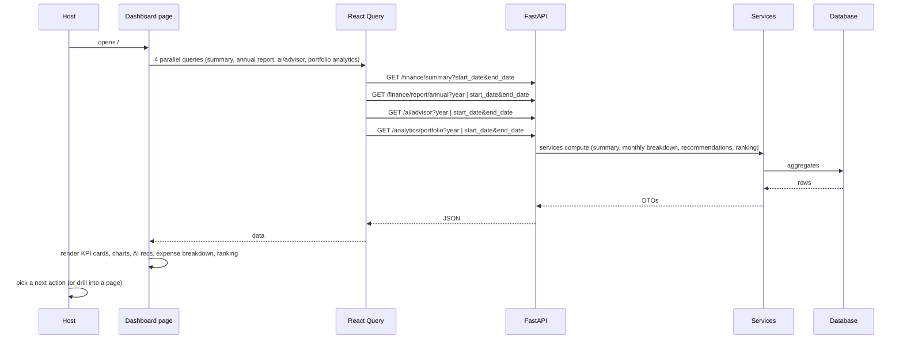

# Dashboard Audit (`/`)

## Purpose

> **v2 update:** The dashboard is **period-driven** — a period selector picks a
> year or a **custom date range**, and every KPI, chart, expense breakdown, AI
> card, and ranking follows it. It honors `default_currency` (all
> KPIs/reports; fallback normalized to EUR app-wide), `dashboard_show_ai_summary`,
> `dashboard_show_forecast`, `dashboard_default_year`, and the business name.
> The KPI grid is now **six cards** (Gross, Net, Profit Margin, **Total
> Expenses**, Cashflow, Properties). It uses the shared `use-api` hooks
> (`useFinancialSummary`, `useAnnualReport`, `useAIAdvisor`, `usePortfolioAnalytics`),
> and the AI card shows which engine is in use (rules vs. configured LLM).

The Dashboard is the **command center**. It exists so a host can answer the
single most common question — *"How is my portfolio doing right now?"* — in
under five seconds, without navigating anywhere.

It solves the business problem of **situational awareness**: a host opens the
app and immediately sees portfolio health (revenue, profit, cashflow),
where money goes (expense breakdown), what the AI thinks is urgent
(recommendations), and where to go next (quick actions). The intended user is
the **owner/operator**, daily.

## Business Objective

After visiting the Dashboard, the user should be able to decide:
- Is the portfolio healthy today? (KPI cards)
- Which trend needs attention? (charts, AI recommendations)
- What is my **next single action**? (Quick Actions + AI recommendations)

## Workflow



## Components

| Component | Responsibility | Dependencies | Relation to page |
| --- | --- | --- | --- |
| `DashboardContent` | Orchestrates the 4 queries + period state + error state | React Query, api | Main body |
| `GrossRevenueCard` / `NetRevenueCard` / `ProfitMarginCard` / `TotalExpensesCard` / `CashflowCard` / `PropertyCountCard` | Display one KPI (6-card grid) | `KPICard`, `formatCurrency` | KPI grid |
| `KPICard` | Generic card with value + trend icon | cn, lucide | Base of all KPI cards |
| `RevenueBarChart` / `CashflowLineChart` | Monthly revenue vs expenses; cashflow line | Chart.js | Charts row |
| AI Financial Advisor card | Executive summary + top-5 recommendations + provider badge (rules vs LLM) | useAIAdvisor data | Insights |
| Expense Breakdown card | Top expense categories with % | annual report data | Cost visibility |
| Quick Actions | Navigation links (Add Property, Import, Add Expense, Reports, Ask AI) | next/link | Navigation |
| Latest Reports card | Report readiness indicators | annual report data | Navigation to /reports |
| Property Ranking card | Ranked properties with medals | portfolio analytics | Navigation to /analytics |

## Hooks

The dashboard uses the shared `use-api` hooks — `useFinancialSummary(start, end)`,
`useAnnualReport(period)`, `useAIAdvisor(period)`, `usePortfolioAnalytics(period)`
— all period-scoped (a `ReportPeriod` of `{year}` or `{start,end}` builds
`year=` or `start_date`/`end_date` query params, so query keys stay consistent).

## API Calls

| Endpoint | Why it belongs here |
| --- | --- |
| `GET /finance/summary?start_date&end_date` | Portfolio-wide financial totals — the core "how are we doing" answer. |
| `GET /finance/report/annual?year \| start_date&end_date` | Monthly breakdown (charts) + expense categories. |
| `GET /ai/advisor?year \| start_date&end_date` | Executive summary + prioritized recommendations — the "what should I do" answer (rules engine by default, LLM when configured). |
| `GET /analytics/portfolio?year \| start_date&end_date` | Property ranking with health scores. |

These four are the minimum surface a host needs to make a daily decision; the
dashboard is deliberately a **read-mostly aggregation page**.

## State Management

- **Server state:** React Query caches all four queries; `staleTime: 0` means
  every visit/focus refreshes — appropriate for "always fresh" command center.
- **Error handling:** any of the four failing renders a single "API Connection
  Error" panel instead of four broken sections.
- **Local state:** none of consequence — the page is purely a projection of
  server state (a good sign: the page has no user input).

## User Journey

```
Open app
  ↓
KPIs load (revenue, margin, cashflow)
  ↓
Charts show monthly trends
  ↓
AI advisor surfaces the top risk/opportunity
  ↓
Expense breakdown shows where money goes
  ↓
User picks Quick Action or clicks a report/ranking item
  ↓
Decision: "I'll investigate cleaning costs" → /finance
```

## Relation With Other Pages

- **Finance:** expense/revenue Quick Actions deep-link here; creating data
  there refreshes the dashboard summary.
- **Properties:** "Add Property" Quick Action; Property Ranking summarizes
  `/analytics`.
- **Analytics:** ranking card is a teaser of the full comparison table.
- **Reports:** "Generate Report" + Latest Reports card link to `/reports`.
- **AI Advisor:** AI recommendations on the dashboard are a teaser; the full
  co-pilot (chat, scenarios) lives at `/ai-advisor`.
- **Auth/Backend:** AppShell gates rendering on backend readiness; auth
  bootstrap happens in `AuthProvider` before the page is useful.

## Architectural Decisions

- **Read-only aggregation page:** no mutations — keeps the command center
  simple and safe.
- **Parallel queries:** React Query fetches all four in parallel, then the page
  renders progressively (per-section skeletons), so perceived load is fast.
- **Single error state:** fail-soft UX — one clear banner rather than a broken
  page.

## Strengths

- Answers "how am I doing + what's next" in one view.
- Progressive skeletons keep it feeling fast.
- Links every section to the deeper page that owns it.

## Weaknesses

- Duplicated query definitions (not using shared hooks).
- `formatCurrency` defaults to USD while the product now has a settings-driven
  default currency — the dashboard should honor `SettingsProvider`
  `default_currency`.
- AI block shows raw recommendations without the "priority/opportunity"
  framing the AI Advisor page now has.

## Technical Debt

- Dashboard bypasses `use-api` hooks → query-key drift.
- Currency not read from settings.
- The "Latest Reports" card fabricates readiness from month counts; a real
  report-status endpoint would be better.

## Future Evolution

- Honor the `dashboard_default`, `dashboard_show_ai_summary`,
  `dashboard_show_forecast`, and `default_currency` settings (the Settings
  store already defines them — the dashboard should consume them).
- Add a "next 30 days" forecast card (data already exists in the AI advisor).
- Surface a compact version of the AI Priority Actions here.
- Migrate to shared hooks and typed schemas.
