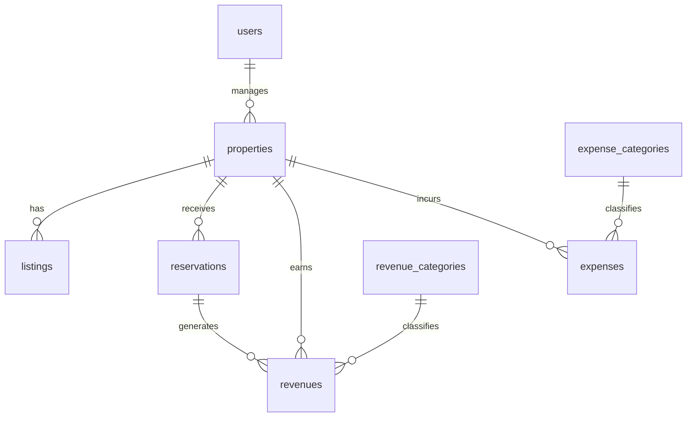

# HostWise — Database Audit

## 1. Overview

HostWise uses **SQLAlchemy 2.0 (async)** with two interchangeable engines:
**SQLite (aiosqlite)** for the local-first desktop app and **PostgreSQL
(asyncpg)** for cloud deployments. The switch is a single env var
(`DATABASE_TYPE`). All models inherit a shared `BaseModel` that provides:

- `id` — **UUID** primary key (portable across SQLite/Postgres; no
  sequence/auto-increment divergence).
- `sync_id` — stable external identifier, **pre-wired for future cloud sync**.
- `created_at` / `updated_at` — audit timestamps.
- `deleted_at` / `is_deleted` — **soft delete** on every entity.

> **Why soft delete?** Financial history is precious and recoverable; a
> mistaken delete must be undoable. The cost (every query filters
> `is_deleted == False`) is enforced centrally in `BaseRepository`.

## 2. Schema (conceptual ER)

## 3. Tables & purpose

| Table | Model | Purpose / business meaning |
| --- | --- | --- |
| `users` | `User` | Login identity (email unique, bcrypt hash, role enum). |
| `properties` | `Property` | A physical rental asset. Carries **financial targets** (`target_occupancy`, `target_annual_revenue`) that drive health scores & goals. |
| `listings` | `Listing` | A property's presence on a platform (Airbnb/Booking/…), pricing defaults. One property → many listings. |
| `reservations` | `Reservation` | A guest booking — the **core domain event** driving analytics. **Provider-agnostic** status/source enums. |
| `revenues` | `Revenue` | Income records (gross, commission, net). |
| `expenses` | `Expense` | Cost records (amount, category, vendor, recurring flag). |
| `revenue_categories` | `RevenueCategory` | Configurable income categories. |
| `expense_categories` | `ExpenseCategory` | Configurable cost categories (backbone of expense analysis). |
| `settings` | `Setting` | Key-value app configuration (currency, tax, AI, appearance, …). |

> Note: there is **no `organizations` table** yet. The business identity is the
> `business_name` setting. Multi-tenancy is a deliberate future step (see
> roadmap), and the schema has no tenant column today.

## 4. Relationships & constraints

- `reservations.property_id` → `properties.id` (CASCADE delete).
- `reservations.listing_id` → `listings.id` (SET NULL).
- `revenues.property_id` → `properties.id` (CASCADE).
- `revenues.reservation_id` → `reservations.id` (SET NULL) — a reservation can
  generate revenue.
- `revenues/expenses.category_id` → category tables (SET NULL).
- `users.email` — unique + indexed.
- Most `property_id` / date columns are **indexed** (query hot paths for
  aggregation).

## 5. Denormalization (deliberate)

`Reservation` stores derived/snapshot fields:
- `nights` (computed at write time for fast occupancy math).
- `net_revenue` (for fast revenue analytics without joins).
- `property_name`, `property_city`, `property_country` (snapshots so history
  survives a property rename).

**Why:** the analytics layer reads reservations constantly; joining to
properties on every occupancy/ADR query would be slower and would lose
historical attribution. The trade-off (kept-in-sync redundancy) is accepted.

## 6. Normalization posture

The schema is **reasonably normalized** (1NF/3NF) with two intentional
exceptions (reservation denormalization above, and settings-as-key-value).
Category and property tables are proper lookup tables. There are no
computed KPI columns — **metrics are computed on demand** (the CID philosophy),
so the schema stores facts, not opinions.

## 7. Indexes & query patterns

- Indexed: `users.email`, `reservations.property_id`, `reservations.check_in`,
  `reservations.confirmation_code`, `revenues.property_id`, `revenues.date`,
  `expenses.property_id`, `expenses.date`.
- Aggregation queries group by month/category/property — these benefit from the
  date + property indexes.

## 8. Migrations

- **Alembic** is configured (`alembic.ini`, `alembic/versions/`) with a sample
  migration (`a1b2c3d4e5f6_add_sync_id_to_all_tables`).
- In practice, **SQLite desktop mode auto-creates tables** at startup via
  `Base.metadata.create_all` in the app lifespan — migrations are not run for
  the desktop build. This keeps desktop deployment simple but means schema
  changes rely on `create_all` only creating new tables (no in-place ALTER).
- The settings key-value store needs **no migration** for new keys (defaults
  are merged server-side).

## 9. Business rules encoded in schema

- Non-negative money amounts (validated in Pydantic + defaults).
- `nights` required on reservations.
- Status normalization enums (`CONFIRMED/CANCELLED/COMPLETED/...`) — the
  cross-platform contract.
- Soft-delete flag on all rows.

## 10. Why this schema exists

It is the minimum schema that supports the product's thesis:
1. **Properties** as the asset anchor.
2. **Reservations** as the normalized, provider-agnostic booking event.
3. **Revenue/expense** as attributable financial facts.
4. **No stored metrics** — because analytics are computed on demand from these
   facts.
5. **`sync_id` + soft delete** — because local-first data will eventually sync
   to the cloud and must never be lost.

## 11. Weaknesses / debt

- `create_all` only adds tables; schema *changes* to existing tables in
  packaged desktop builds need a migration strategy (or a "schema version" +
  patch approach).
- No tenant column — multi-tenancy requires a migration.
- `settings` values are untyped JSON strings.
- Occupancy math uses 365 days regardless of listing availability.
- No full-text search; no archive/partitioning strategy for large histories.

## 12. Future evolution

- Introduce a lightweight schema-version + upgrade path for packaged desktop DBs.
- Add `organizations` tenant boundary when multi-user/agency mode ships.
- Move heavy aggregate queries to a reporting/analytics read model if scale
  demands (while keeping CID as the source of truth).
- Add proper availability (blocked nights) for accurate occupancy.
- Add full-text search for reservations/guests; archiving for old years.
