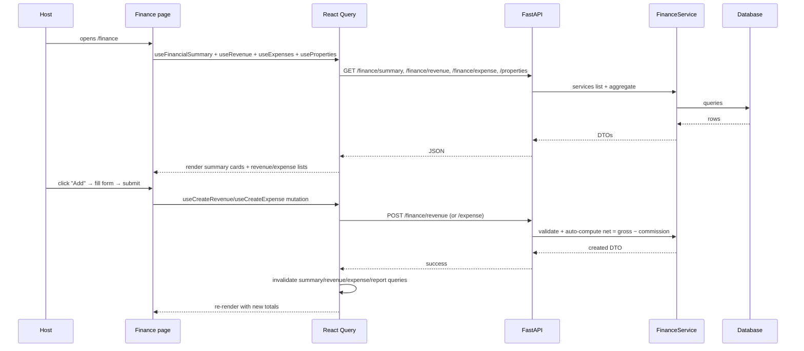

# Finance Audit (`/finance`)

## Purpose

> **v2 update:** Full **CRUD** for both revenue and expense — create, edit
> (PATCH), and delete (soft) via typed TanStack Query mutations with cache
> invalidation. Added a filters bar (property + date range) and it honors the
> settings `default_currency`.

The Finance page is the **transaction ledger** of HostWise. It exists so a
host can *record and inspect every euro/dollar* of revenue and expense — the
raw material that every other page (analytics, AI, reports) consumes.

It solves the data-capture problem: without accurate revenue/expense records,
there are no insights. It is the **write-heavy** page of the app.

The intended user is the **owner/operator or a bookkeeper** doing daily/weekly
data entry, and anyone reconciling a booking platform payout.

## Business Objective

After visiting, the user should be able to:
- Record a new revenue (booking payout) or expense (cleaning, maintenance).
- See whether the portfolio is cashflow-positive.
- Spot the split between gross revenue, commissions, and costs.

## Workflow



## Components

| Component | Responsibility |
| --- | --- |
| `SummaryCards` | Gross, Net, Expenses, Cashflow, Margin — top-line health |
| `RevenueSection` | Revenue list + inline create form (property, date, gross, commission) |
| `ExpenseSection` | Expense list + inline create form (property, date, amount, vendor, category, recurring) |
| UI primitives | Card, Input, Label, Button, Badge |

## Hooks

- `useFinancialSummary()` → `/finance/summary`
- `useRevenue()` / `useCreateRevenue()` → list + create
- `useExpenses()` / `useCreateExpense()` → list + create
- `useProperties()` → populate the property dropdowns

The create mutations **invalidate** `["revenue"]`, `["expenses"]`,
`["financial-summary"]`, `["monthly-report"]`, and `["annual-report"]` — so a
new entry immediately refreshes the dashboard, reports, and AI inputs. This is
the correct cache-invalidation strategy for a write-heavy domain.

## API Calls

| Endpoint | Why it belongs here |
| --- | --- |
| `GET /finance/summary` | Top-line totals for the summary cards. |
| `GET /finance/revenue` / `GET /finance/expense` | The ledgers. |
| `POST /finance/revenue` / `POST /finance/expense` | Manual data capture; backend **auto-computes `net_amount = gross − commission`** so the user can't enter inconsistent rows. |
| `GET /properties` | Property dropdowns for attribution. |

## State Management

- Server state: React Query (lists + summary), invalidated on mutation.
- Local state: form fields (`useState`), open/closed form panels.
- The page is the **primary write surface**; everything downstream reads from
  the same tables.

## User Journey

```
Open /finance
  ↓
See summary cards (gross, net, expenses, cashflow, margin)
  ↓
Add a revenue: pick property, date, gross, commission
  ↓
Backend computes net; list + totals refresh
  ↓
Add an expense: property, amount, category, vendor
  ↓
Decision: "Cashflow is positive this month" or "expenses look high — check categories"
```

## Relation With Other Pages

- **Dashboard:** reads `summary`; its Quick Actions deep-link to "Add Revenue /
  Add Expense" here.
- **Analytics / AI / Reports:** all consume the revenue/expense tables this
  page writes. Finance is the **source of truth** for the money.
- **Import:** CSV import inserts revenue/expense/reservation rows directly into
  the same tables (an alternative write path to manual entry).
- **Settings:** the display currency preference affects how these numbers are
  formatted.

## Architectural Decisions

- **Auto-computed net revenue** in the service — business rule lives in the
  service, not the form (prevents inconsistent data from any client).
- **Thin, dependency-free create forms** — forms construct DTOs and POST; the
  service owns validation.
- **Aggressive cache invalidation on write** — because downstream consumers
  (reports/AI) are expensive to recompute, keeping their cache fresh is
  critical.

## Strengths

- Simple, fast manual entry.
- Net-revenue auto-calculation removes a whole class of data-entry errors.
- Correct invalidation wiring keeps derived pages fresh.

## Weaknesses

- No edit/delete UI in the page (the API supports PATCH/DELETE; the UI does
  not surface them) — a host cannot correct a mistaken entry from here.
- No filters/search/pagination UI on the lists.
- No category management UI (categories exist in the DB and are used by the
  CSV import, but the user can't create/rename them).
- Hardcodes `currency: "USD"` in the create form instead of using the
  settings default currency.

## Technical Debt

- Missing edit/delete flows.
- Category management unimplemented (categories are the backbone of expense
  analysis — without good categories, expense insights are weak).
- Form validation is ad-hoc; react-hook-form is a dependency but not used here.

## Future Evolution

- Add inline edit/delete with optimistic updates.
- Add filters (date range, property, category) and pagination.
- Add category management + category defaults.
- Honor `default_currency` from settings.
- Add recurring-expense recognition and payout reconciliation against platform
  statements.
