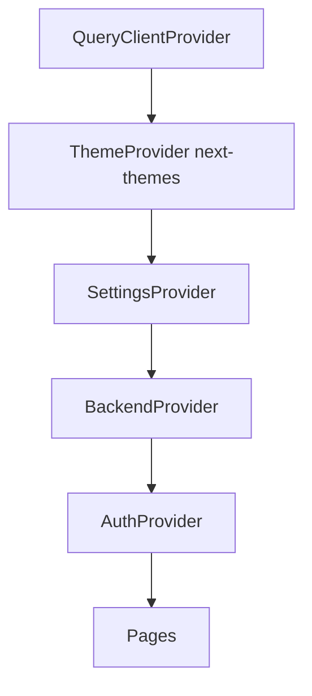
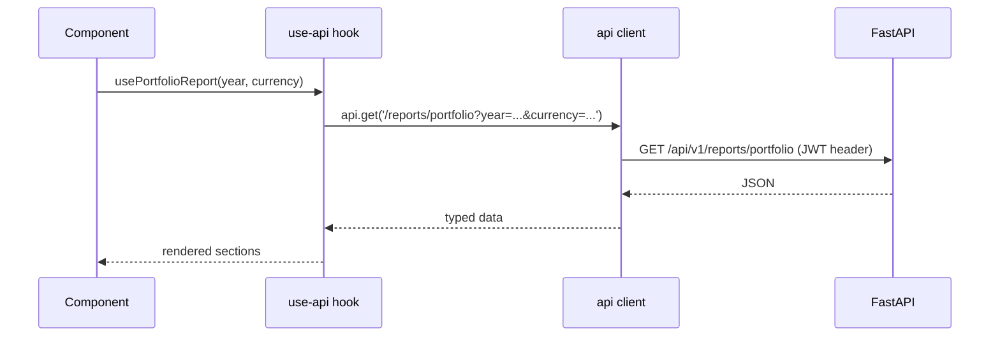

# HostWise — Frontend Architecture

## 1. Overview

The frontend is a **Next.js 14 App Router** application written in
**TypeScript**, styled with **TailwindCSS + shadcn/ui**, and rendered inside a
**Tauri v2** WebView for the desktop product. In development it runs as a
plain web app (`next dev`) against a locally running FastAPI backend.

> **Why Next.js?** The team wanted a productive, typed React framework with a
> mature ecosystem. It also gives a path to a hosted web product later (the
> desktop is the MVP; the same codebase can be deployed to the web).

> **Why Tauri over Electron?** Tauri produces much smaller binaries, uses the
> OS WebView (lower memory), and is Rust-based — a deliberate "local-first,
> lightweight" product decision.

### Folder layout

```
src/
  app/            # Next.js App Router pages + root layout
    page.tsx            # Dashboard
    analytics/          # /analytics
    finance/            # /finance
    properties/         # /properties
    reports/            # /reports
    ai-advisor/         # /ai-advisor
    settings/           # /settings
    import/             # /import
    guide/              # /guide (in-app help)
    providers.tsx       # global providers
    globals.css         # theme tokens + print/accent/compact styles
  components/
    layout/             # app-shell, sidebar, connection-banner, error-boundary, welcome-wizard
    dashboard/          # kpi-cards, charts (Chart.js)
    reports/            # report section components
    ai/                 # AI advisor section components
    settings/           # settings section components
    ui/                 # shadcn primitives (button, card, badge, input, ...)
  contexts/
    auth-context.tsx
    backend-context.tsx
    settings-context.tsx
  hooks/
    use-api.ts          # typed React Query hooks
  lib/
    api.ts              # API client (JWT, retries, dynamic base URL)
    utils.ts            # cn(), currency/date formatting
    report-types.ts     # portfolio report types
    ai-types.ts         # AI advisor types
    settings-types.ts   # backup/maintenance types
    reports-export.ts   # CSV / Excel / PDF(print) / share helpers
```

## 2. Providers & Global State



| Provider | Responsibility | Why it exists |
| --- | --- | --- |
| `QueryClientProvider` | React Query cache + defaults (staleTime 0, refetch on focus) | Central server-state config. |
| `ThemeProvider` | Light/Dark/System theme | Appearance setting applied globally. |
| `SettingsProvider` | Loads `GET /settings`, exposes `get/updateSetting/updateSettings`, applies appearance side-effects (accent CSS var, compact class, no-anim class) | One source of truth for config; settings genuinely affect the whole app (currency, theme, density). |
| `BackendProvider` | Backend status (starting/healthy/unreachable/crashed/restarting), `restartBackend()` via Tauri command; listens to `backend-status` events | The desktop app is only useful when the sidecar backend is healthy — this drives the connection banner and AppShell loading state. |
| `AuthProvider` | Auto-login bootstrap (`setup/initialize` → `login` → `me`), exposes `user` | Local-first: no login screen; the app just works. |

## 3. State Management Strategy

HostWise uses a deliberate three-way split:

1. **Server state → TanStack Query** (`hooks/use-api.ts`).
   - Query keys are stable and cacheable (e.g. `["financial-summary"]`,
     `["annual-report", year]`, `["portfolio-report", year, currency]`).
   - Mutations invalidate the exact dependent queries (e.g., creating an
     expense invalidates `revenue`, `expenses`, `financial-summary`, reports).
   - `staleTime` is 0 by default (always fresh), with page-level
     `staleTime: 30_000` on expensive report/AI queries to avoid hammering the
     backend.
   - **Why:** React Query gives cache, dedup, retry, background refetch, and
     loading/error states for free — exactly what a data-heavy analytics app
     needs.

2. **Global client state → Context.**
   - `auth`, `backend`, `settings` are app-wide and read across many pages;
     context is the right tool (React Query would be awkward for imperative
     values like "backend status").

3. **Local UI state → `useState` / `useReducer`.**
   - Form state, open/closed panels, sort fields, chat messages, scenario
     inputs.

> **Weakness:** the dashboard page uses inline `useQuery` calls instead of the
> `use-api` hooks (duplication of query keys and shapes). This is inconsistent
> with the rest of the app and should be refactored to the hooks.

## 4. The API Client (`lib/api.ts`)

- Centralizes the backend base URL: resolves via Tauri `get_backend_url()`
  command when running in the desktop shell, otherwise falls back to
  `NEXT_PUBLIC_API_URL || http://127.0.0.1:8000/api/v1`.
- Injects the JWT (`hostwise_access_token`) from localStorage.
- Retries transient failures (5xx and network errors) with exponential backoff
  (3 attempts, capped at 4s).
- Exposes `get/post/put/patch/delete` — thin, typed, consistent.
- **Why:** every request needs the same auth + retry + URL-resolution logic;
  centralizing it means pages never think about transport.

## 5. Component Patterns

- **Container/Presentation** is used informally: pages (`*Page`) compose
  section components (e.g., `ReportsContent`), and presentational components
  (e.g., `ReportSection`, `KpiCard`, `PropertyCard`) receive data via props.
- **Composition over inheritance** everywhere; small focused components
  (`Toggle`, `SettingRow`, `ProgressBar`, `ReportSection`) reused across pages.
- **shadcn/ui primitives** (`components/ui/*`) provide consistent styling
  tokens; pages rarely hand-roll buttons/cards.
- **Charts** are isolated in `components/dashboard/charts.tsx` (Chart.js)
  and reused across Dashboard, Analytics, and Reports — one styling source.

## 6. Styling & Theming

- Design tokens in `globals.css` (Airbnb-inspired palette: `--primary`
  `rgb(255, 56, 92)`, success teal, etc.) with a `.dark` variant.
- `next-themes` toggles the `class` strategy.
- **Runtime theming (new in v0.5):**
  - Accent colors via `html[data-accent]` overrides of `--primary`/`--ring`.
  - Compact mode via `html.compact` spacing overrides.
  - Animations off via `html.no-anim`.
  - These are driven by the `SettingsProvider` — the Settings page controls
    them live.
- **Print/PDF** styles hide the sidebar, keep report sections intact
  (`break-inside: avoid`), and are the mechanism behind the PDF export buttons.

## 7. How the Frontend Talks to the Backend



## 8. Strengths

- Centralized API client (auth/retry/URL in one place).
- React Query discipline keeps pages declarative and cache-aware.
- Contexts are few and purposeful.
- Reusable section/primitive components keep pages composable.
- Runtime theming is cleanly wired to the Settings store.

## 9. Weaknesses / Technical Debt

- **Pervasive `any`** in hooks and several pages — the biggest type-safety gap.
- Dashboard bypasses `use-api` hooks.
- Analytics page contains **hardcoded ADR/RevPAR arrays** (fake demo data).
- Hardcoded `localhost:8000` in `auth-context` and `backup-section` (should use
  the dynamic base URL).
- No component tests / no Storybook.
- The in-app Guide is a static config object — fine now, but will drift from
  the real UI as features change.

## 10. Future Evolution

- Adopt typed API schemas (openapi-typescript from the backend's OpenAPI).
- Introduce a real form library + validation consistently (react-hook-form is
  already a dependency but is only partially used).
- Move dashboard data fetching into `use-api` hooks.
- Replace fake analytics trend data with a real endpoint.
- Add e2e tests (Playwright) for the critical flows: import → dashboard →
  report → export.
