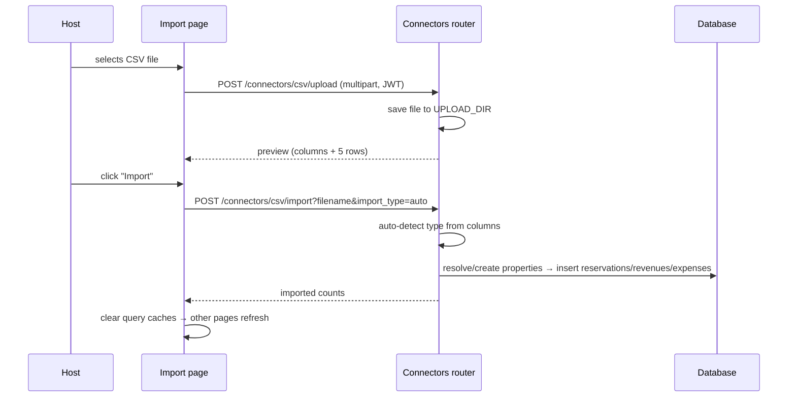

# Import Audit (`/import`)

## Purpose

> **v2 update:** The page is **CSV-only** — JSON support was removed from the UI
> (the backend connector still accepts JSON via its API). It includes an in-page
> **Import Guide** whose required/optional columns mirror the downloadable
> **sample templates** (`/samples/reservations.csv`, `revenues.csv`,
> `expenses.csv`), and routes calls through the dynamic `api` client (no
> hardcoded `localhost:8000`). Expense `category` values are matched to real
> expense categories (created automatically if missing) so the analytics
> breakdown never shows “Uncategorized”. Parsing/insertion lives in
> `ConnectorService`, honoring `import_date_format` and `default_currency`.

The Import page is the **onboarding engine** of HostWise. It exists so a host
can go from a platform CSV export (Airbnb transactions, Booking
reservations, a spreadsheet of expenses) to a fully populated HostWise
database in minutes — without manual entry.

It solves the **cold-start problem**: an analytics platform is worthless
without data, and manual entry of months of history is not acceptable. The
intended user is the **owner/operator** during onboarding or ongoing
periodic imports.

## Business Objective

After visiting, the user should be able to:
- Upload a CSV, preview its detected columns, and import it safely.
- Confirm how many rows were imported.
- Be confident the data now flows into Dashboard, Finance, Analytics,
  Reports, and AI.

## Workflow



> The page routes upload + import through the shared `api` client
> (`api.upload` / `api.post`), so the dynamic backend URL is honored in the
> packaged (Tauri) app.

## Components

| Component | Responsibility |
| --- | --- |
| `ImportPage` | Layout: File Upload + Import Guide + Sample Templates + Connectors cards |
| `CSVUploadSection` | File select (accept `.csv`), upload/preview, import, result display |
| Import Guide | Required vs optional columns per type (matches the sample templates) |
| Sample Templates | Download `reservations.csv` / `revenues.csv` / `expenses.csv` from `/samples/*.csv` to base your own data on |
| Connectors card | Lists CSV (active) + planned platform connectors |

## Hooks

- The page uses **local `useState`** (file, preview, uploading/importing flags,
  result) but routes requests through the shared `api` client
  (`api.upload` / `api.post`) so the dynamic base URL is honored.

## API Calls

| Endpoint | Why |
| --- | --- |
| `POST /connectors/csv/upload` | Save the file + return column preview (safe first step before any DB write). |
| `POST /connectors/csv/import?filename&import_type` | Detect type, map/create properties, insert normalized rows. |
| `GET /connectors/available` | (Defined) lists available connectors — not currently called by the page. |

## Business logic in the import endpoint

The import endpoint (in the router) does the real work:
- **Auto-detects the CSV type** from column names (reservations vs revenues vs
  expenses).
- **Resolves properties** — matches by CSV property name to existing DB
  properties, and **auto-creates missing properties** (from name/city/country
  columns).
- **Normalizes statuses** (Airbnb "confirmed" / Booking "reserved" → the
  provider-agnostic `CONFIRMED` enum) — this is the key to cross-platform
  analytics.
- Inserts reservations, revenues, and expenses with computed fields
  (`nights`, `net_revenue`).

## State Management

- Local component state only; no React Query on this page.
- After import, other pages refresh because they re-query on mount/focus.

## User Journey

```
Open /import
  ↓
Download a sample template (Reservations / Revenues / Expenses) to base your data on
  ↓
Drop a CSV
  ↓
Upload & Preview → see detected columns
  ↓
Import → see "N rows imported"
  ↓
Dashboard/Finance/Analytics now show real data
  ↓
Decision: fix property names in future CSVs for cleaner matching
```

## Relation With Other Pages

- **Finance / Properties / Reservations:** the import endpoint writes to the
  exact tables these pages read — import is an alternative write path to manual
  entry.
- **Dashboard / Analytics / Reports / AI:** all downstream consumers light up
  once data exists.
- **Settings:** `import_date_format`, `default_currency`, `import_encoding`
  and `import_delimiter` are all honored by the importer.

## Architectural Decisions

- **Two-step upload→import** — upload gives a safe preview *before* any write;
  import is explicit. Reduces accidental mass imports.
- **Auto property creation** — lets a host import a platform export without
  pre-registering properties.
- **Provider-agnostic normalization** — the reservation model's status/source
  enums are the seam for future platform connectors; CSV import exercises the
  same normalization path a connector will use.

## Strengths

- Fast cold-start; the fastest path from "I have a CSV" to "I have insights."
- The normalization layer is future-proof for real platform connectors.
- Imports are **idempotent**: re-importing the same file skips rows whose
  natural key already exists (reservations by confirmation code; revenues by
  property+date+amount+source; expenses by property+date+amount+vendor+category),
  and the result reports `skipped` counts.
- An **iCal connector** (`POST /connectors/ical/upload` + `/import`) turns
  Airbnb/Booking calendar VEVENTs into reservations and skips re-imported UIDs.

## Weaknesses

- Limited error feedback (a generic "Import failed" in some paths).
- No per-column mapping UI yet (column names must match the documented samples).

## Technical Debt

- Add per-column mapping UI (column names must match the documented samples).
- Add transaction rollback reporting (partial import counts) on failure.

## Future Evolution

- Airbnb/Booking/VRBO connectors behind the `ConnectorRegistry` seam already
  present in `connectors/base.py`. **Note:** Airbnb and Booking expose no
  official public reservations API for hosts — iCal calendar export is the
  supported integration path, and it is already implemented.
- Scheduled auto-sync.
- Column-mapping wizard for non-standard CSVs.
- Import history + undo.
