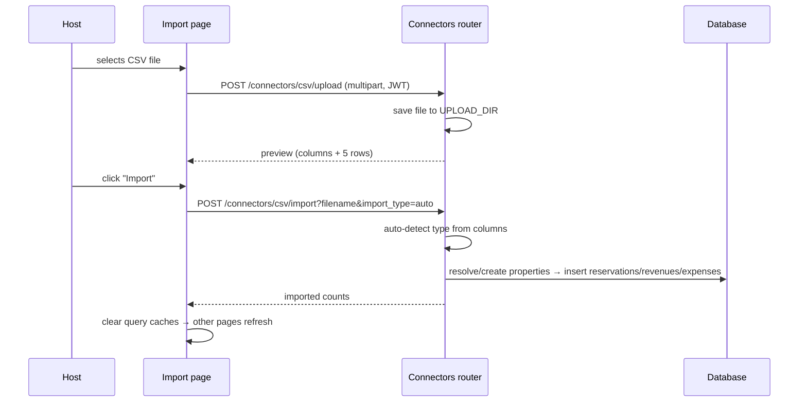

# Import Audit (`/import`)

## Purpose

> **v2 update:** The page now includes an in-page **Import Guide** (required vs.
> optional columns per type), supports **JSON** files in addition to CSV, and
> routes all calls through the dynamic API client (no hardcoded `localhost:8000`).
> Parsing/insertion moved into the backend `ConnectorService` layer, which honors
> `import_date_format` and `default_currency` settings.

The Import page is the **onboarding engine** of HostWise. It exists so a host
can go from a platform CSV export (Airbnb transactions, Booking
reservations, a spreadsheet of expenses) to a fully populated HostWise
database in minutes — without manual entry.

It solves the **cold-start problem**: an analytics platform is worthless
without data, and manual entry of months of history is not acceptable. The
intended user is the **owner/operator** during onboarding or ongoing
periodic imports.

## Business Objective

After visiting, the user should be able to:
- Upload a CSV, preview its detected columns, and import it safely.
- Confirm how many rows were imported.
- Be confident the data now flows into Dashboard, Finance, Analytics,
  Reports, and AI.

## Workflow



> Note: the current `/import` page performs upload + import via **raw `fetch`
> calls to `http://localhost:8000`** rather than the `api` client. This works in
> dev but bypasses the dynamic base URL used in the packaged app — see debt.

## Components

| Component | Responsibility |
| --- | --- |
| `ImportPage` | Layout: CSV Upload card + Connectors card |
| `CSVUploadSection` | File select, upload/preview, import, result display |
| Connectors card | Lists CSV (active) + planned platform connectors |

## Hooks

- The page uses **local `useState`** (file, preview, uploading/importing flags,
  result) and raw `fetch` — it does not use the `use-api` hooks. This is the
  oldest part of the frontend and predates the hook layer.

## API Calls

| Endpoint | Why |
| --- | --- |
| `POST /connectors/csv/upload` | Save the file + return column preview (safe first step before any DB write). |
| `POST /connectors/csv/import?filename&import_type` | Detect type, map/create properties, insert normalized rows. |
| `GET /connectors/available` | (Defined) lists available connectors — not currently called by the page. |

## Business logic in the import endpoint

The import endpoint (in the router) does the real work:
- **Auto-detects the CSV type** from column names (reservations vs revenues vs
  expenses).
- **Resolves properties** — matches by CSV property name to existing DB
  properties, and **auto-creates missing properties** (from name/city/country
  columns).
- **Normalizes statuses** (Airbnb "confirmed" / Booking "reserved" → the
  provider-agnostic `CONFIRMED` enum) — this is the key to cross-platform
  analytics.
- Inserts reservations, revenues, and expenses with computed fields
  (`nights`, `net_revenue`).

## State Management

- Local component state only; no React Query on this page.
- After import, other pages refresh because they re-query on mount/focus.

## User Journey

```
Open /import
  ↓
Drop a CSV (Airbnb transactions)
  ↓
Upload & Preview → see detected columns
  ↓
Import → see "N rows imported"
  ↓
Dashboard/Finance/Analytics now show real data
  ↓
Decision: fix property names in future CSVs for cleaner matching
```

## Relation With Other Pages

- **Finance / Properties / Reservations:** the import endpoint writes to the
  exact tables these pages read — import is an alternative write path to manual
  entry.
- **Dashboard / Analytics / Reports / AI:** all downstream consumers light up
  once data exists.
- **Settings:** `import_encoding` / `import_delimiter` / `import_date_format`
  settings exist in the store but are not yet consumed by the import endpoint
  (a gap).

## Architectural Decisions

- **Two-step upload→import** — upload gives a safe preview *before* any write;
  import is explicit. Reduces accidental mass imports.
- **Auto property creation** — lets a host import a platform export without
  pre-registering properties.
- **Provider-agnostic normalization** — the reservation model's status/source
  enums are the seam for future platform connectors; CSV import exercises the
  same normalization path a connector will use.

## Strengths

- Fast cold-start; the fastest path from "I have a CSV" to "I have insights."
- The normalization layer is future-proof for real platform connectors.

## Weaknesses

- Import logic lives **in the router** (violates the thin-router convention);
  it should be a `ConnectorService`.
- Uses raw `fetch` to a hardcoded URL instead of the `api` client / dynamic
  base URL.
- Import settings (encoding/delimiter/date format) are stored but unused.
- Limited error feedback (a generic "Import failed" in some paths).

## Technical Debt

- Move CSV parsing/import into a service layer.
- Route through the `api` client (dynamic base URL) for the packaged app.
- Honor import settings; add per-column mapping UI.
- Add transaction rollback reporting (partial import counts) and idempotency
  (avoid duplicate imports of the same file).

## Future Evolution

- Real connectors (Airbnb/Booking/VRBO APIs, iCal) behind the `ConnectorRegistry`
  seam already present in `connectors/base.py`.
- Scheduled auto-sync.
- Column-mapping wizard for non-standard CSVs.
- Import history + undo.
