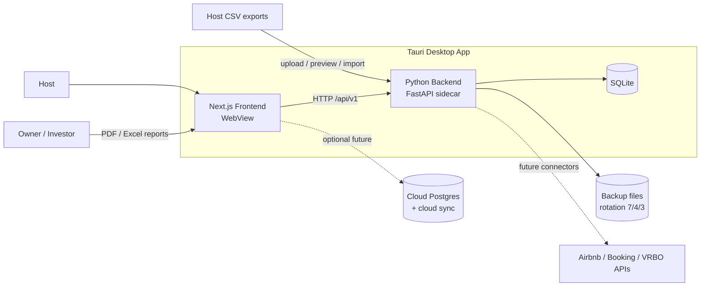
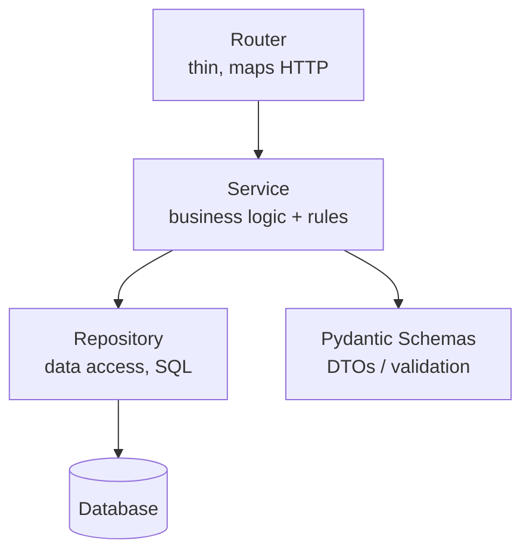
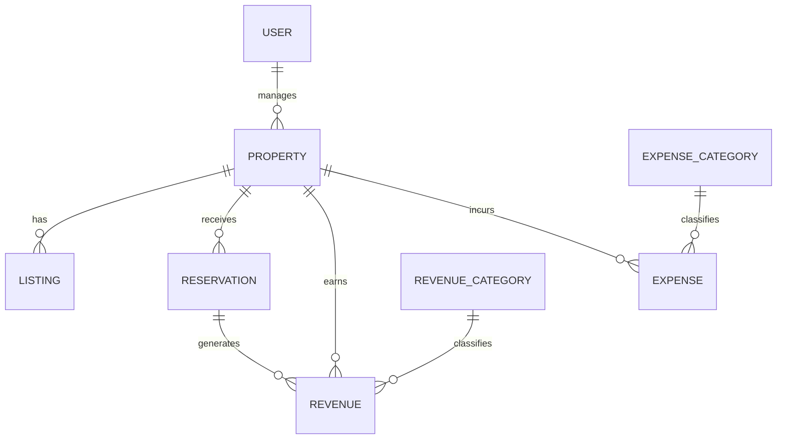
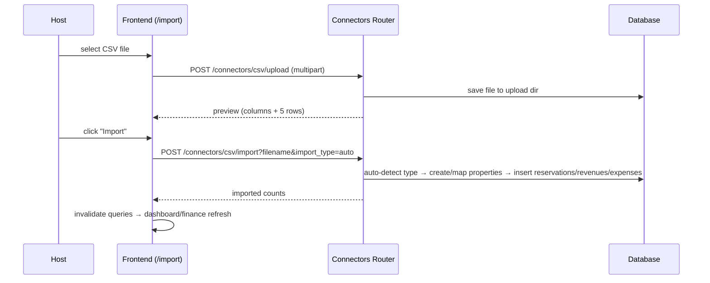
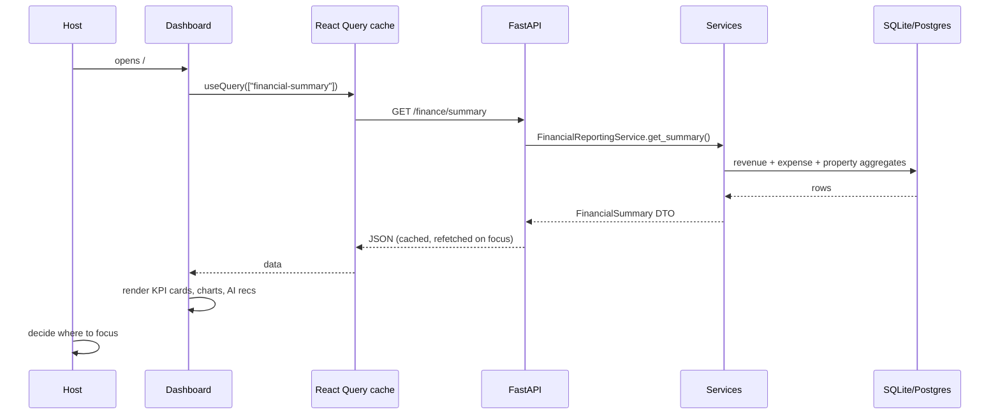
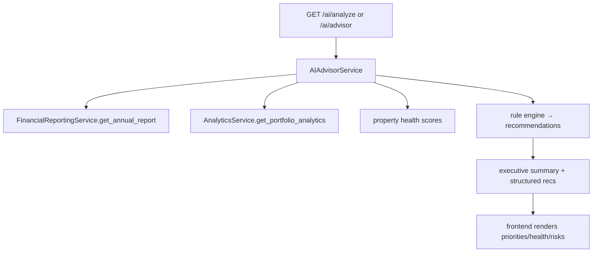

# HostWise — Overall Architecture

> **One-sentence mission:** HostWise is an AI-powered financial intelligence
> platform for vacation-rental hosts — the analytics layer on top of booking
> data, delivered as a **local-first, cloud-optional** desktop application.

This document is the master map of the system. It explains **what** HostWise
is, **why** it is shaped the way it is, **how** data flows through it, and
**how it should evolve**. Every other document in this audit expands on a slice
of this one.

---

## 1. What HostWise Is (Business View)

### The problem it solves

Vacation-rental hosts operate across Airbnb, Booking.com, VRBO, direct
bookings, and offline cash deals. Their data is scattered across platforms in
CSV exports and dashboards. They face a recurring set of questions:

- *How is my whole portfolio really doing?*
- *Which property is dragging me down and why?*
- *Is my pricing right?*
- *Where is my money going?*
- *What should I do next month?*

Existing PMS tools focus on **managing bookings** (calendars, channels,
inquiries). HostWise deliberately does **not** compete there. It competes in
the layer above: **understanding and improving financial performance**.

### The product promise

> "Transform raw booking and financial data into professional reports,
> strategic insights, and actionable recommendations — instead of merely
> displaying charts."

This promise is encoded in the **three product pillars**:

1. **Intelligence** — computed, profit-driven KPIs (revenue, profit, margins,
   expense ratios, health scores), not just raw rows. Occupancy/ADR/RevPAR are
   intentionally **not** tracked (HostWise is not a PMS).
2. **Explanation** — every number is explained (trend explanations, AI
   summaries, "why it happened"), not just shown.
3. **Action** — recommendations, priorities, what-if scenarios, and chat
   ("ask the AI").

### Who uses it

- **Individual hosts** — a few properties, CSV exports, wants simple answers.
- **Small operators / agencies** — many properties, wants portfolio analytics
  and owner reports.
- **Owners / investors** — receive executive summaries and tax-oriented reports
  (read-only consumers of exported documents).

---

## 2. What HostWise Is (Technical View)

| Layer | Technology | Why |
| --- | --- | --- |
| Desktop shell | **Tauri v2 (Rust)** | Small (~MB) binaries vs. Electron; embeds the Python backend as a sidecar; local-first ethos. |
| Frontend | **Next.js 14 (App Router), TypeScript, Tailwind + shadcn/ui, Chart.js, TanStack Query, next-themes** | Fast, typed, composable UI; React Query for server-state discipline. |
| Backend | **FastAPI, SQLAlchemy 2.0 async, Pydantic v2, Python 3.10** | Async throughout; typed request/response contracts; strong OpenAPI story. |
| Database | **SQLite (aiosqlite) for desktop** OR **PostgreSQL (asyncpg) for cloud** | One codebase, two engines, switched by `DATABASE_TYPE`. Local-first → SQLite default. |
| Identity | **Auth-free** — local single-user; `profile_name` / `profile_email` stored as settings (no login, no tokens, no default credentials) | Zero friction for a local-first product. (Legacy JWT/bcrypt auth module retained but retired.) |
| AI | **Rule-based analysis engine** by default + **BYOK** (bring-your-own-key) LLM proxy when the user configures `ai_api_key`/`ai_base_url`/`ai_model` | Deterministic, offline, private, cheap by default; power users can attach OpenAI/Anthropic-compatible or Ollama. |
| Packaging | **PyInstaller** (backend binary) + **Tauri** bundling (.deb/.rpm/.AppImage/.msi/.exe/.dmg) | Local-first desktop distribution on all platforms. |

### System context (Mermaid)

---

## 3. Architectural Style

HostWise uses a **modular monolith** with **layered (onion-ish) domains** and
strong **Clean-Architecture influences**.

### Why a modular monolith (not microservices)?

- **One team, one deployable.** Microservices would add network failure modes,
  orchestration, and versioning complexity for zero benefit at this scale.
- **Local-first requirement.** A desktop app must ship the backend as one
  process; microservices are impossible.
- **Domain boundaries still matter.** The codebase is split into packages
  (`auth`, `properties`, `finance`, `analytics`, `ai`, `reports`, `settings`,
  `reservations`, `connectors`) so that a future extraction *is possible*
  without paying the cost today.
- **DB transactionality.** Cross-domain operations (CSV import touches
  properties + reservations + finance) share one transaction/session.

### Layering within each domain

Each layer depends **inward** only:

- **Router** — declares endpoints, wires dependencies, never contains business
  logic. (One exception: `connectors/router.py` holds CSV parsing logic — see
  Technical Debt.)
- **Service** — the heart. All business rules, calculations, and orchestrations
  live here ("never in the router" is an explicit convention).
- **Repository** — isolates SQLAlchemy. `BaseRepository[ModelType]` provides
  generic CRUD; each domain adds targeted aggregation queries.
- **Schema** — Pydantic v2 request/response DTOs; `response_model` enforces the
  contract at the boundary.

### Repository pattern — why

Repositories exist so that:
1. **The ORM never leaks into services.** If HostWise switches from SQLAlchemy
   to something else, only repositories change.
2. **Complex queries are named and testable** (e.g.,
   `get_monthly_revenue`, `get_revenue_by_category`).
3. **Soft-delete is enforced once** — every base query filters
   `is_deleted == False`, so callers can't accidentally read deleted rows.

### Dependency Injection — why

FastAPI `Depends` provides:
- **Session-per-request** via `get_db()` (commit/rollback/close lifecycle
  handled centrally).
- **Service-per-request** via `get_*_service` dependencies.
- Testability — swap a dependency for a fake.

---

## 4. Backend Module Map

| Package | Responsibility | Key outputs | Depends on |
| --- | --- | --- | --- |
| `auth` | *(retired in v2)* legacy Users/JWT — kept for compatibility, unused by the UI | `User`, tokens | core, shared |
| `properties` | Portfolio assets + listings | `Property`, `Listing` | core, shared |
| `reservations` | Guest bookings (normalized) | `Reservation` | core, shared, properties |
| `finance` | Revenue/expense + category aggregation | `FinancialSummary`, `MonthlyReport`, `AnnualReport`, `CategoryBreakdown` | core, shared, properties |
| `analytics` | Computed KPIs, seasonality, health scores | portfolio/property analytics, `property_ranking` | core, shared, finance, reservations, properties |
| `ai` | Rule-based advisor, dashboard, chat, scenarios | recommendations, `AdvisorReport`, chat answers, scenario projections | analytics, finance, properties |
| `reports` | Professional documents | weekly/monthly/annual/executive/portfolio reports | finance, analytics, ai, settings |
| `settings` | Key-value app configuration | merged settings map | core |
| `connectors` | Data ingestion (CSV now; platform APIs later) | upload/preview/import | core, finance, reservations, properties |
| `core` | Config, DB engine/session | `Settings`, `engine`, `get_db` | — |
| `shared` | Base model, base repository, exceptions, base schemas | cross-cutting primitives | core |

### Cross-module communication rules

- Domains communicate through **services** (composition), never by reaching
  into another domain's repository from a router.
- Example: `reports` constructs `FinancialReportingService`, `AnalyticsService`,
  `AIAdvisorService`, and `SettingsService` and composes their outputs.
- The `finance` repository methods are the **single source of truth** for
  revenue/expense aggregation; analytics and AI reuse them rather than
  re-implementing SQL.

---

## 5. The Data Model (Conceptual)

Every entity inherits `BaseModel`: **UUID PK**, **`sync_id`** (future cloud
sync), **`created_at`/`updated_at`**, and **soft-delete** (`deleted_at`,
`is_deleted`). See [database-audit.md](./database-audit.md) for the full schema.

---

## 6. End-to-End Data Flows

### 6.1 CSV import (the primary onboarding path)

Business value: a host can go from a platform CSV export to a full financial
picture in two clicks — no manual data entry. This is the **onboarding moat**.

### 6.2 Reading a page (dashboard example)

### 6.3 AI analysis (computed on demand)

---

## 7. The Frontend, in Brief

- **App Router** pages: `/` (dashboard), `/analytics`, `/finance`,
  `/properties`, `/reports`, `/ai-advisor`, `/settings`, `/import`, `/guide`.
- **`AppShell`** provides the sidebar, connection banner, error boundary, and
  the Welcome wizard — every page is composed inside it.
- **Providers** (in `providers.tsx`): React Query → next-themes →
  `SettingsProvider` → `BackendProvider` → `AuthProvider` (auth context now
  derives the user from settings — no tokens).
- **Server state** lives in TanStack Query via `hooks/use-api.ts` (typed hooks
  for summary, reports, portfolio, AI, backups, maintenance, etc. — full CRUD
  mutations for revenue/expense/property).
- **Global client state** lives in contexts: `auth`, `backend` (status +
  restart), `settings` (config + appearance side-effects).
- **API access** is centralized in `lib/api.ts` (`api.get/post/put/patch/
  delete/upload`) with dynamic base-URL resolution (`getApiBaseUrl()`/
  `getApiHost()`) and retry/backoff. No auth header is needed.

See [frontend-architecture.md](./frontend-architecture.md).

---

## 8. Architectural Principles (the WHY)

1. **Computed Intelligence on Demand (CID).** Analytics and health scores are
   *never stored* — they are computed per request. Stored metrics go stale the
   moment new data arrives; computed metrics are always correct. Cost is
   acceptable because a single user's dataset is small.
2. **Local-first, cloud-optional.** The app must work fully offline on the
   user's machine; the cloud is an enhancement, never a dependency.
3. **Explain, don't just display.** Every major surface pairs a number with a
   reason (trend explanations, AI summaries, "why it happened").
4. **Structured AI output.** The AI produces `{cause, impact, action,
   confidence}` objects — not free text — so the UI can render them and the
   engine can be swapped for an LLM without changing the interface.
5. **Thin routers, rich services.** Business logic in services keeps routers
   readable and logic unit-testable.
6. **Schema-first contracts.** Pydantic response models are the API's contract;
   `response_model` guarantees shape.
7. **Soft delete everywhere.** Data is recoverable and history is preserved.
8. **`sync_id` on every row.** The schema is future-proofed for cloud sync.

---

## 9. Strengths

- **Coherent product thesis** — every page maps to a host decision, not a
  feature checklist.
- **Clean layering** — services/repositories/schemas are consistently
  separated; adding an endpoint is mechanical.
- **Dual-database capability** with one codebase (SQLite/Postgres).
- **Local-first packaging** (Tauri + PyInstaller) is genuinely user-friendly
  and private.
- **Rule-based AI** is deterministic, testable, offline, and private — a
  defensible MVP choice with an LLM-ready seam.
- **Comprehensive reporting & AI surfaces** differentiate it from chart-only
  dashboards.
- **On-demand computation** avoids a whole class of stale-metric bugs.

## 10. Weaknesses (current limitations)

- **Test suite covers the backend** (36 tests) but there is no frontend/e2e
  test suite yet.
- **No multi-currency conversion** — settings pick a display currency only.
- **No organizations / multi-tenancy** — `business_name` is a setting, not a
  tenant boundary.
- **BYOK LLM is a thin proxy** — no streaming, retries, or token accounting yet.

## 11. Technical Debt (should improve later, not now)

- AI chat recomputes the full advisor report per question (slow on large
  portfolios); needs a cheaper, per-intent data path or caching.
- `analyze_financial_performance` recomputes portfolio analytics + per-property
  health, which itself recomputes per-property analytics — nested recomputation.
- Legacy JWT auth module and legacy report endpoints remain in the codebase
  (unused by the UI) — harmless but adds surface area.
- No pagination beyond `limit/skip` defaults; no server-side filtering on most
  list endpoints beyond query params.
- No migration workflow for the `settings` key-value store.
- The report PDF is a browser print layout (not a server-generated PDF) — fine
  for local use, but a server-side generator would enable email delivery.
- `docs`/`data` sample CSVs and `uploads` are committed.

## 12. Future Evolution (see also [roadmap.md](./roadmap.md))

1. **Post-MVP (already partially shaped):** real connectors (Airbnb/Booking
   APIs, iCal), email reports, notifications engine.
2. **LLM phase (BYOK done):** the rule engine is already swappable via user
   API keys; next steps are richer prompt tuning, streaming, and token
   accounting. Rules remain the offline fallback.
3. **Cloud phase:** enable the Postgres backend + cloud sync via the
   pre-existing `sync_id` columns; multi-device.
4. **Multi-tenancy:** introduce an `organizations` tenant boundary (the
   `business_name` setting is the seed of this concept) when multi-user or
   agency mode arrives.
5. **Enterprise:** SSO, audit logs, advanced tax/accounting export, automated
   owner statements, reconciliation against platform payouts.

---

## 13. Decision Log (summary)

The full log is in [decision-log.md](./decision-log.md). Highlights:

| Decision | Why |
| --- | --- |
| Modular monolith | One deployable, local-first, domain boundaries preserved. |
| SQLite by default / Postgres optional | Local-first; zero setup for desktop. |
| Compute metrics on demand | Always fresh; small data; avoids stale caches. |
| Rule-based AI with LLM seam | Deterministic, private, offline, cheap; swappable later. |
| Repository pattern | Isolates ORM; enforces soft-delete. |
| Auto-login (no login screen) | Local-first UX; the DB is the owner's own. |
| File-copy + VACUUM backups with 7/4/3 rotation | Simple, robust for SQLite; safety backup before restore. |
| Dynamic backend port (18000–18099) | Avoids desktop port conflicts. |
| Soft delete + `sync_id` on all tables | Recoverability + future sync. |
