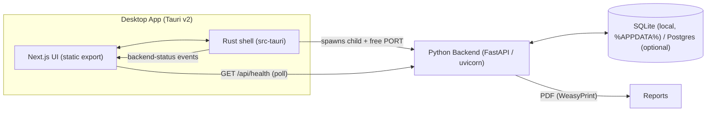

# HostWise — Production & Architecture Overview

> One-file summary of what the app is, how the desktop app works, and how it is
> built and released. Last updated for **v0.6.9** (2026-08-06).

---

## 1. What the app is

**HostWise** is a **local-first, AI-powered financial intelligence platform for
vacation rental hosts**. It sits on top of existing data sources (Airbnb,
Booking.com, CSV exports) and turns raw booking data into strategic insights,
automated reports, and recommendations.

- **It is NOT a PMS.** It does not manage bookings, process payments, or handle
  guest communication — it is "the brain, not the hands."
- **Who it is for:** individual hosts managing ~3–50 properties, and small
  property managers who need portfolio-level financial visibility.

**Core features:**
- CSV imports (Airbnb / Booking.com / revenue / expense templates)
- Financial KPIs per property and portfolio: revenue, expenses, cashflow,
  occupancy, ADR, RevPAR, cancellation rates, profit margins
- AI-powered recommendations with explanations
- Automated monthly/annual financial reports (PDF)
- Dashboards and revenue-trend analysis
- Local-first: your data stays on your machine; no cloud account required

---

## 2. Repository structure

```
HostWise-PMS/
├── backend/                  # Python FastAPI service
│   ├── app/                  #   auth, properties, reservations, finance,
│   │                         #   analytics, reports, ai, settings, ...
│   ├── alembic/              #   DB migrations
│   ├── hostwise-backend.spec #   PyInstaller build spec (onedir)
│   ├── launcher.py           #   backend entry point (windowed-safe)
│   └── tests/                #   pytest suite
├── frontend/                 # Next.js 14 + Tauri v2 desktop shell
│   ├── src/app               #   web UI (static export -> ../out)
│   ├── src/contexts          #   backend connection state
│   ├── src-tauri/            #   Rust desktop shell (backend spawn/port mgmt)
│   └── e2e/                  #   Playwright end-to-end tests
├── docs/                     # architecture & audit docs
├── docker/                   # backend + frontend Dockerfiles
├── docker-compose.yml
├── scripts/                  # build helpers
└── .github/workflows/        # ci.yml, release.yml, build-*.yml
```

---

## 3. System architecture



- **Tier 1 — UI:** Next.js 14 (React 18, Tailwind, TanStack Query, Chart.js).
  Built to a static export in `frontend/out` and loaded inside a Tauri webview.
- **Tier 2 — Rust shell (Tauri v2):** spawns and supervises the local backend.
- **Tier 3 — Backend:** Python 3.12 + FastAPI + SQLAlchemy/Alembic. Serves the
  REST API (`/api/v1/*`) and the health endpoint (`/api/health`) on a **dynamic
  local port**.

Backend domains: authentication, properties, reservations, finance, analytics,
reports (incl. PDF), AI advisor, settings, maintenance, notifications, and data
connectors/imports.

---

## 4. The desktop app (Tauri v2 shell) in detail

### 4.1 How it starts
1. Tauri `setup()` calls `backend::spawn()` (in `frontend/src-tauri/src/backend.rs`).
2. Rust **picks a free port** (prefers `8000`, otherwise an OS-assigned port —
   avoids conflicts with other software on the machine).
3. The backend is spawned as a **child process** with `PORT` set, so uvicorn
   binds exactly that port. On Windows it is launched with `CREATE_NO_WINDOW`.
4. The webview shows **"Starting HostWise…"** while the frontend polls
   `GET http://127.0.0.1:<port>/api/health` every 1.5 s.
5. The Rust shell emits **`backend-status`** events (`healthy` / `failed`);
   the frontend also self-poll as a fallback. On success the live URL is stored
   in managed state and exposed via the `get_backend_url` command.
6. When the last window is destroyed, the Rust shell **kills the backend child**.

### 4.2 Backend packaging
- The backend is packaged with **PyInstaller (onedir)** via
  `backend/hostwise-backend.spec` (Python 3.12).
- The bundle is copied into `frontend/src-tauri/resources/hostwise-backend` and
  mapped in `tauri.conf.json` (`resources.hostwise-backend -> hostwise-backend`),
  so the installer carries it and Rust can execute it.
- `launcher.py` handles: windowed-mode stdout fix (devnull streams so uvicorn's
  logging doesn't crash), `HOST`/`PORT` env, data dir resolution
  (`%APPDATA%\HostWise\hostwise.db` on Windows), backup scheduling, uvicorn with
  3 start attempts, and `access_log=False`.

### 4.3 Connection UX
- `frontend/src/contexts/backend-context.tsx` owns connection state and exposes
  `{ status, error, isReady, restartBackend }`.
- A **connection banner** (`connection-banner.tsx`) appears for
  unreachable/crashed/restarting/failed states, shows the reason (including a
  "quarantined by Windows Defender" message since v0.6.9) and a **Restart
  Backend** button that calls the `restart_backend` Tauri command.

### 4.4 Desktop app facts (v0.6.9)
- Product name: **HostWise** · identifier `com.hostwise.desktop`
- Window: 1280×820 (min 940×620), resizable, centered
- Category: Finance · target platforms: Windows, macOS, Linux
- NSIS installer hooks kill the running backend during install/uninstall
  (`frontend/src-tauri/nsis/hooks.nsh`) so upgrades never hit
  "file in use / MSVCP140.dll" errors.

---

## 5. CI/CD pipelines

### 5.1 `ci.yml` — quality gates (every push/PR to `main`)
- Python lint via **ruff** (non-blocking)
- Frontend lint via **Next.js**, **`tsc --noEmit`**
- Backend **pytest** suite
- **Playwright** end-to-end tests (browser)

### 5.2 `release.yml` — production release (triggered by `v*` tag push or manual dispatch)

Three **independent** jobs so one platform failing never blocks the others; all
publish to the same GitHub Release (`softprops/action-gh-release`,
`fail_on_unmatched_files: false`).

| Job | Runner | Output | Notes |
|---|---|---|---|
| Windows | `windows-latest` | NSIS installer `.exe` | Python 3.12 + PyInstaller → bundle → `bunx tauri build --bundles nsis` → optional signing |
| macOS | `macos-latest` | `.dmg` | same + optional notarization |
| Linux | `ubuntu-latest` | `.deb` (+ AppImage best-effort) | system webkit/pango deps; AppImage has `continue-on-error` |

Key details:
- **Python pinned to 3.12** (3.10 produced broken `_ssl` under PyInstaller).
- **No PE stripping on Windows** (`strip = sys.platform != "win32"` in the spec;
  MinGW `strip` corrupts the bundled DLLs).
- Optional **code signing** is a no-op unless secrets exist (checked in-script,
  never in `if:`):
  - `WINDOWS_CERT_BASE64` / `WINDOWS_CERT_PASSWORD` (signtool) for the installer
  - `APPLE_ID` / `APPLE_APP_SPECIFIC_PASSWORD` / `APPLE_TEAM_ID` for notarization
- AppImage is best-effort only (`NO_STRIP=true`, `continue-on-error`) due to an
  upstream linuxdeploy issue (tauri-apps/tauri#14796).

### 5.3 `build-*.yml` (Windows / macOS / Linux)
Manual-only legacy build workflows, no tag triggers — useful for ad-hoc builds.

---

## 6. How to cut a release (the normal workflow)

1. Bump the app version in `frontend/src-tauri/tauri.conf.json` (e.g. `0.6.9`).
2. Commit: `git add -A && git commit -m "v0.6.9: ..."`
3. Tag: `git tag v0.6.9`
4. Push: `git push origin main && git push origin v0.6.9`
5. `release.yml` runs; installers are published to the GitHub Release for the
   tag. Download and test the Windows installer on a real Windows 10/11 PC.

---

## 7. Known issues & how they were solved (lessons learned)

| # | Problem | Root cause | Fix (version) |
|---|---|---|---|
| 1 | Windows `_ssl` / DLL load crash | PyInstaller `strip` corrupting PE DLLs | disable strip on win32; pin `cryptography==49.0.0` (v0.6.2) |
| 2 | `libgobject-2.0-0` missing on Windows | WeasyPrint needs GTK/Pango | lazy import + graceful 503 (v0.6.4) |
| 3 | Crash in uvicorn logging | windowed app has `sys.stdout = None` | devnull streams in `launcher.py` (v0.6.5) |
| 4 | Stuck on "Starting HostWise…" | Rust never emitted status events | health poll + `backend-status` events + `restart_backend` (v0.6.6) |
| 5 | NSIS "Error opening file for writing" | backend child locked DLLs during install | NSIS hooks kill the backend (v0.6.7) |
| 6 | "Could not connect to backend" | fixed port 8000 conflict | dynamic free port + `PORT` env (v0.6.8) |
| 7 | "Detected as virus" + backend won't run | **unsigned** exe blocked by Defender/SmartScreen | v0.6.9 surfaces the real reason in-app; mitigation below |

### 7.1 Windows Defender / SmartScreen (current known limitation)
- Windows treats unsigned executables as suspicious by default, so it can
  quarantine `hostwise-backend.exe` and block the app from starting.
- **Chosen mitigation (free, no certificate):** the developer adds **one Defender
  exclusion** during customer setup — Windows Security → Virus & threat
  protection → Manage settings → Exclusions → add the HostWise install folder
  and `%LOCALAPPDATA%\HostWise`. The customer then never deals with it again.
- Optional free extra: submit the release `.exe` at
  `microsoft.com/en-us/wdsi/filesubmission` so Defender whitelists it.
- **Permanent fix (deferred):** Authenticode code signing (a purchased cert via
  signtool, or Microsoft's Azure Artifact Signing, pay-per-signature). Declined
  for now — target audience is a single non-technical customer on Windows 10/11.

---

## 8. Current release state

| Version | Highlight | Installers |
|---|---|---|
| v0.6.8 | Dynamic free port (fixes port-8000 conflicts) | Windows NSIS, macOS dmg, Linux deb |
| v0.6.9 | In-app backend failure reason (incl. antivirus/quarantine) | published from `release.yml` |

Working tree is clean; next release is one tag away (see §6).
