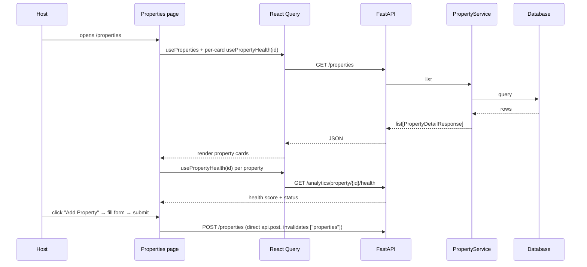

# Properties Audit (`/properties`)

## Purpose

> **v2 update:** Full **CRUD** — create/edit (including `target_annual_revenue`)
> and soft-delete via the API. Selecting a property opens a **detail modal** with
> profit-focused analytics (net revenue, profit, expenses, margin, reservations,
> avg stay, cancellation, expense ratio, health) plus a combined **Monthly
> Revenue & Expenses** bar chart (Net Revenue + Expenses datasets with a custom
> legend), honoring the settings currency. Reservations/avg stay are derived from
> the monthly breakdown (the property endpoint doesn't return them directly).

The Properties page manages the **portfolio of assets** — the physical units
whose performance everything else measures. It exists so a host can register
and view their properties, with a live **Health Score** (0–100) per property.

It solves the "what am I managing?" problem: before there is data, there must
be properties to attribute revenue/expenses/reservations to. The intended
user is the **owner/operator** setting up the system.

## Business Objective

After visiting, the user should be able to:
- Register a property in seconds (name, type, location, size).
- Instantly see which property is healthy vs. concerning (Health Score).
- Decide which property to investigate next (deep-dive lives in Analytics).

## Workflow



## Components

| Component | Responsibility |
| --- | --- |
| `PropertyList` | Fetch, create form, grid of `PropertyCard` |
| `PropertyCard` | Name, type, location, bedrooms/guests, health badge, “Click for analytics” |
| Form (inline) | Create property (name, type, city, country, bedrooms, bathrooms, max_guests) |
| `PropertyDetailModal` | Per-property analytics modal: 9-stat grid + combined Monthly Revenue & Expenses chart (Net Revenue + Expenses datasets, custom legend) |

## Hooks

- `useProperties()` → `/properties` list.
- `usePropertyHealth(propertyId)` → per-property health score.
- `usePropertyAnalytics(propertyId, year)` → detail modal data (net revenue, profit,
  expenses, margin, monthly breakdown incl. `total_expenses` per month).
- Create uses **direct `api.post` + manual invalidation** (inconsistent with
  the create-mutation pattern used in Finance — a small debt).

## API Calls

| Endpoint | Why |
| --- | --- |
| `GET /properties` | List all properties with listings. |
| `POST /properties` | Create a property (the write surface). |
| `GET /analytics/property/{id}/health` | Health score badge per card (margin, cancellation rate, expense ratio, net revenue). |
| `GET /analytics/property/{id}?year` | Detail modal: totals + `monthly_breakdown[]` (each month: gross/net revenue, reservation_count, nights, `total_expenses`). |

> Note: `GET /properties` returns `PropertyDetailResponse` (with listings) even
> for the list view — slightly heavier than needed; a lightweight summary
> schema (`PropertySummaryResponse`) exists in the schemas but is not used.

## State Management

- Server state: React Query (`["properties"]`), invalidated after create.
- Health scores: one query per property card (React Query dedupes/caches).
- Local state: create form + error message.

## User Journey

```
Open /properties
  ↓
See property cards with health badges
  ↓
Add a property (name, type, location, capacity)
  ↓
Card appears with a health score (computed from real data)
  ↓
Click "Click for analytics" → modal with stats + Monthly Revenue & Expenses chart
  ↓
Decision: "Villa Atlas is healthy (85); Apartment B (55) needs a look" → /analytics
```

## Relation With Other Pages

- **Finance:** property dropdowns everywhere derive from this page's data.
- **Analytics:** per-property health/ranking is computed from property targets
  (`target_occupancy`, `target_annual_revenue`) set on properties.
- **AI Advisor:** property reviews and risk detection reason over per-property
  health.
- **Reports:** property performance tables aggregate by property.
- **Import:** CSV import auto-creates properties from the file when they don't
  exist (the page benefits retroactively).

## Architectural Decisions

- **Health Score computed on demand** (AnalyticsService) — never stored.
- **Targets as first-class fields** (`target_occupancy`,
  `target_annual_revenue`) — these are the inputs that make "health" and "goals"
  meaningful; a deliberate data-model choice.
- **Property + Listings split** — one physical property, many platform
  listings (Airbnb/Booking/VRBO) — mirrors the real world and future
  connectors.

## Strengths

- Extremely fast onboarding (form + immediate health badge).
- Health score gives an instant, data-backed triage of the portfolio.

## Weaknesses

- No edit/delete UI (API supports PATCH; the page doesn't surface it).
- No per-property deep-dive from the card (would need `/analytics/property/{id}`).
- List endpoint returns heavyweight detail schema.

## Technical Debt

- Create uses direct `api.post` instead of a mutation hook.
- No edit/delete; no listing management UI (listings exist in the API).
- Targets (`target_occupancy`, `target_annual_revenue`) aren't editable in the UI
  — they're important for health/goals and currently only settable via API/import.

## Future Evolution

- Full CRUD (edit, archive/delete) with optimistic updates.
- Property detail page with per-property analytics + listings management.
- Editable health targets (Settings or inline).
- Photo/amenity metadata for richer owner-facing cards.
