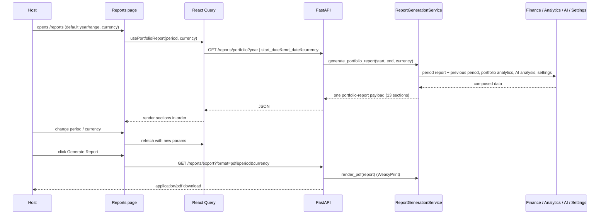

# Reports Audit (`/reports`)

## Purpose

> **v2 update:** Reports are **period-driven** — pick a year or a **custom date
> range** plus currency (defaults from Settings), and the report compares the
> period against the **equal-length previous period**. **Generate Report**
> downloads a professional PDF rendered on the backend (WeasyPrint, white
> background) rather than a browser print. Reports include an **AI Executive
> Insights** section (rules engine, or your connected LLM — provider badge).
> Occupancy/ADR were removed from all sections; the Portfolio Health Revenue bar
> scores growth vs the previous period (with the % shown) instead of a flat
> amount.

The Reports page is the **professional documentation surface** of HostWise. It
exists so a host can turn raw operational data into an investor/owner-ready
financial report — the same document a host would hand to a partner, an
accountant, or a lender.

It solves the "prove the performance" problem: hosts need to communicate value
to people who will never open the app. The intended users are the **owner
(preparing it) and the reader (investor / owner / accountant) who receives a
PDF/Excel export**.

## Business Objective

After visiting, the user should be able to:
- See the full portfolio story: executive summary, AI insights, KPI
  comparison, per-property performance, expense analysis, health, risks,
  forecast, and tax summary.
- **Export** a professional PDF document (backend-generated) to give to a third
  party.
- Decide: *is the portfolio story strong enough to present / borrow against /
  report to an owner?*

## Workflow



## Components

| Component | Responsibility |
| --- | --- |
| `ReportsPage` | Year + currency state; orchestrates fetch, loading, error |
| `ReportHeader` | Period selector (year presets + custom range), currency selector, **Generate Report** (downloads backend PDF), metadata |
| `ExecutiveSummary` | Period, gross revenue, net profit, margin, best/worst property, health badge |
| `AIInsights` | Narrative summary, change drivers, biggest risk, recommendation + provider badge (rules vs LLM) |
| `KpiComparison` | Previous vs Current vs Change table (revenue/profit/expenses) |
| `RevenueBarChart` / `CashflowLineChart` | Monthly visuals (reused) |
| `PropertyPerformance` | Per-property table + Export button |
| `ExpenseAnalysis` | Category bars + biggest/smallest/fastest-growing |
| `MonthlyTimeline` | Horizontal per-month revenue bars (print-friendly) |
| `PortfolioHealth` | Score ring + component bars (Revenue shows growth % vs prev period) + distribution |
| `BusinessRisks` | Risk cards (high/medium) |
| `Forecast` | Next-quarter revenue, confidence, expected occupancy |
| `TaxSummary` | Rental income, deductible expenses, taxable income + tax liability |
| `Notes` | Free-text notes persisted to localStorage per year |
| `ReportSection` / `ProgressBar` | Shared building blocks |

## Hooks

- `usePortfolioReport(period, currency)` — single query for the whole page
  (typed `useQuery<PortfolioReport>`, key `["portfolio-report", period, currency]`,
  builds `year=` or `start_date`/`end_date`).

## API Calls

| Endpoint | Why |
| --- | --- |
| `GET /reports/portfolio?year \| start_date&end_date&currency` | One endpoint composes **everything** the page needs (current + equal-length previous period, portfolio analytics, AI analysis, settings). |
| `GET /reports/export?format=pdf&year \| start_date&end_date&currency` | Renders the same report as a professional PDF (WeasyPrint) and downloads it as `hostwise-report-<period>.pdf`. |

## State Management

- Server state: one React Query query (year+currency as key).
- Local state: `year`, `currency` (drives refetch), notes (localStorage).
- No context — self-contained page.

## User Journey

```
Open /reports
  ↓
Pick a year or custom date range + currency
  ↓
Executive summary (period, revenue, profit, margin, health)
  ↓
AI insights explain the changes + risks
  ↓
KPI comparison (this period vs the previous one)
  ↓
Charts + property table + expense analysis
  ↓
Forecast + tax summary
  ↓
Generate Report → download the PDF → send to owner/accountant
```

## Relation With Other Pages

- **Dashboard:** "Latest Reports" card deep-links here; the annual report data
  it uses is a subset of this page.
- **AI Advisor:** the AI insights here are a condensed view of the advisor's
  analysis (both use `AIAdvisorService`).
- **Analytics/Finance:** reports are the polished, presentational rendering of
  the same underlying financial/analytics data.
- **Settings:** business settings (default currency, tax rate) **directly
  affect** this page — currency defaults and the tax summary's tax liability.

## Architectural Decisions

- **One aggregated endpoint per report** (`/reports/portfolio`) — the backend
  composes 13 sections so the frontend is purely presentational and PDF-printing
  is consistent.
- **Backend drives business settings into reports** — default currency and tax
  rate are read from the settings store, making reports reflect the user's
  business config (a direct expression of "settings affect reports").
- **Dependency-free exports** — PDF via `window.print()` + print CSS, Excel via
  HTML-table `.xls`, CSV via RFC-4180 — no heavy export libraries.
- **Print-first layout** — `break-inside: avoid`, hidden sidebar, so the
  browser's "Save as PDF" yields a clean document.
- **Computed-on-demand** — the report is always fresh because it's computed
  from live data each request.

## Strengths

- One endpoint, one query — simple, fast to reason about.
- Professional, exportable output (the product's core value proposition).
- Settings actually influence the report (currency, tax).
- Notes section lets the host add human context to the numbers.

## Weaknesses

- Report computation is heavy (annual report × 2 + portfolio analytics + AI
  analysis + per-property health) — several seconds on larger portfolios.
- PDF export depends on browser print fidelity (acceptable, but not pixel-perfect).
- No scheduled/email delivery yet (Settings exposes the options, the scheduler
  doesn't exist).

## Technical Debt

- Nested recomputation in `generate_portfolio_report` (annual report itself
  computes previous-year summary; portfolio analytics computes per-property
  health which computes per-property analytics).
- No caching layer for report payloads.
- `TaxSummary` is a simple estimate (no per-jurisdiction rules).

## Future Evolution

- Add caching / a report "rendered at" timestamp to make repeat loads cheap.
- Wire `report_auto_generate` + `report_send_email` settings to a real
  scheduler + email service.
- Add jurisdiction-aware tax logic and official tax-filing exports.
- Add owner-facing white-labeled report branding (business name/logo from
  settings).
