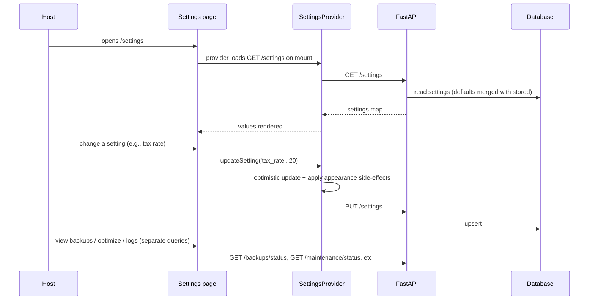

# Settings Audit (`/settings`)

## Purpose

> **v2 update:** The Dashboard, Reports, and Notifications sections were removed.
> The page now runs Profile → Business → AI → Appearance → Security (left column)
> and Backup → Import → Maintenance → About → Developer (right column). Profile
> name/email are editable (bound to settings). The AI section is a BYOK
> connection UI (provider, API key, base URL, model, “Test Connection”). Security
> now offers **Export all** (`.xls`) and **Delete all data** (wipe, keeps settings).
> Backup gained an **Upload** (`.db`) button.

The Settings page is the **configuration and housekeeping center**. It exists
so a host can tailor HostWise to their business (currency, tax rate, AI
behavior, appearance, dashboard defaults) and operate it (backups, maintenance,
diagnostics).

It solves two problems: **personalization** (make the tool match the business)
and **operability** (keep the local-first app healthy — back up data, optimize
the DB, read logs when something breaks).

## Business Objective

After visiting, the user should be able to:
- Set the business identity and tax context that **propagate into reports**.
- Choose appearance/theme and dashboard defaults.
- Understand backup health and restore if needed.
- Run maintenance (optimize, clear cache, reset demo data) and read logs.

## Workflow



## Components

| Component | Responsibility |
| --- | --- |
| `AccountSection` | Name/email (read-only) + currency/timezone/date-format/language |
| `BusinessSection` | Business name, country, default currency, tax rate, fiscal year |
| `AISection` | Provider, enabled, analysis level, auto-analysis, language |
| `DashboardSection` | Default dashboard, show AI summary, show forecast, default year |
| `ReportsSection` | Default report/format, auto-generate, email |
| `NotificationsSection` | Which events notify (toggles) |
| `BackupSection` | Status cards + create/restore/download/delete |
| `ImportSection` | CSV encoding, delimiter, date format |
| `AppearanceSection` | Theme, accent swatches, compact mode, animations |
| `SecuritySection` | Password, sessions, 2FA (coming soon), export/delete account |
| `MaintenanceSection` | DB size, optimize, clear cache, logs, reset demo data |
| `AboutSection` | Version, license, updates |
| `DeveloperSection` | Collapsible: backend status, API URL, restart, logs, copy diagnostics |

## Hooks / Context

- `SettingsProvider` (context) — `get`, `updateSetting`, `updateSettings`,
  `ready`; applies theme/accent/compact/animations live.
- `useBackupStatus()`, `useMaintenanceStatus()`, `useOptimizeDatabase()`,
  `useResetDemoData()`, `useBackendLogs()`.
- `useBackend()` (developer section), `useAuth()` (profile).

## API Calls

| Endpoint | Why it belongs here |
| --- | --- |
| `GET/PUT /settings` | The settings store (backend honors it: reports currency/tax). |
| `GET /backups/status` | Backup schedule overview. |
| `GET /backups/`, `POST /backups/create`, `POST /backups/restore/{n}`, `GET /backups/download/{n}`, `DELETE /backups/{n}` | Backup lifecycle. |
| `GET /maintenance/status` | DB size + storage overview. |
| `POST /maintenance/optimize` | VACUUM. |
| `GET /maintenance/logs` | Read backend logs. |
| `POST /maintenance/reset-demo-data` | Clear transactional demo data. |

## State Management

- **Settings**: `SettingsProvider` context — one global store, optimistic
  writes, appearance applied via side-effects on `document.documentElement`.
- **Backup/maintenance**: React Query (server state) with mutations.
- **Local**: collapsible sections, log viewers.

## User Journey

```
Open /settings
  ↓
Profile + business settings (set your currency, tax rate, business name)
  ↓
AI settings (enable/detail)
  ↓
Appearance (pick theme + accent → whole app changes live)
  ↓
Check backups (last backup, storage) — create/restore if needed
  ↓
Maintenance (optimize DB, clear cache, read logs)
  ↓
Developer (diagnostics only if something breaks)
```

## Relation With Other Pages

- **Reports / AI Advisor:** settings **feed them** (default currency, tax rate,
  AI language/level). This is the clearest cross-page data flow: Settings
  → store → reports tax summary & currency.
- **Dashboard:** dashboard preferences + default currency should drive the
  dashboard (partially implemented — see debt).
- **AppShell:** `SettingsProvider` is mounted globally; `BackendProvider`
  status drives the developer section; theme/accent apply app-wide.

## Architectural Decisions

- **Backend settings store (not just localStorage)** — so the backend can honor
  them (reports currency/tax). LocalStorage-only would make settings cosmetic.
- **Key-value JSON store with defaults merged server-side** — new settings need
  no migration.
- **SettingsProvider as global context** — one read, applied everywhere;
  appearance side-effects centralized.
- **Destructive actions are double-confirmed** (reset demo data) and scoped
  (never touches properties/users/settings).
- **Backups are file-copy + VACUUM with rotation** — simple and local.

## Strengths

- Settings genuinely affect the product (currency/tax reach reports).
- Local-first operations (backups, restore, maintenance) are first-class.
- Appearance is applied live via CSS variables — instant feedback.
- Developer diagnostics are tucked away but complete.

## Weaknesses

- Some settings are stored but **not yet consumed** (dashboard prefs,
  notifications, report auto-generate, AI analysis level/language).
- No notifications engine / scheduler yet.
- Security actions (change password, export/delete account) are placeholders.

## Technical Debt

- Backend `settings` values are JSON strings with no per-key schema validation.
- `SettingsProvider.load()` could theoretically overwrite an optimistic change
  if a user edits within the first second (minor race).
- Dead `components/layout/backup-settings.tsx` superseded by `BackupSection`.

## Future Evolution

- Wire stored settings into their consumers (dashboard prefs, notifications,
  scheduler, AI level/language, email reports).
- Add a notifications engine and a report scheduler (using stored
  `report_auto_generate`/`report_send_email`).
- Per-key validation + typing for settings.
- Multi-tenant organization settings (business identity → `organizations`).
